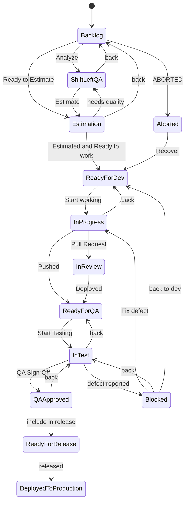
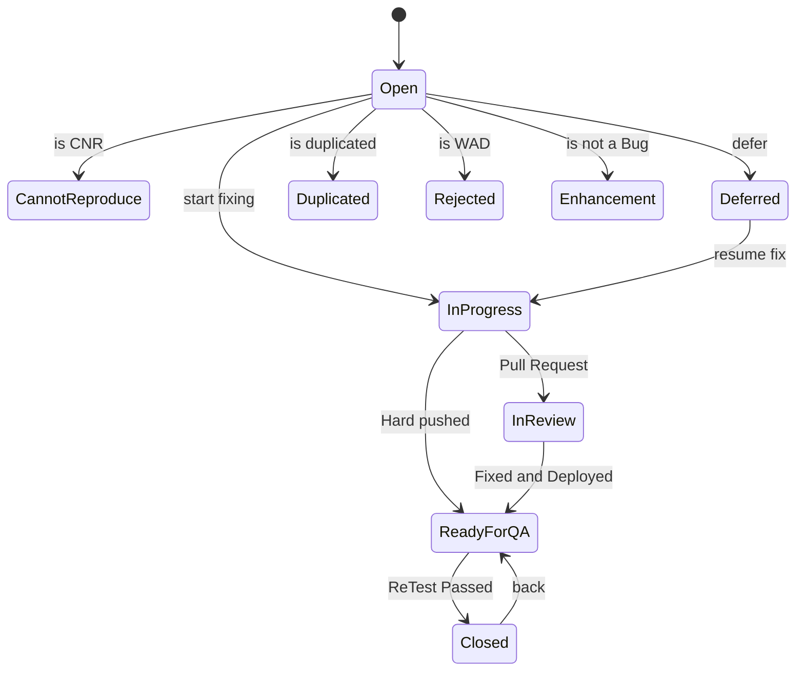

# Product Backlog Items (PBI)

Per-epic and per-story QA workspace shared by `/shift-left-testing`, `/sprint-testing`, `/test-documentation`, and `/test-automation`.

> **This tree is OWNED by `scripts/sync-jira-issues.ts`.** Module = Epic (1:1). **Jira is the source of truth; every `[SYNC]` `.md` here is a read-only cache.** NEVER hand-write a Jira-mirrored file — generate the content, push it to the Jira field (or fallback comment), run the sync, then read the materialized file back. Authoritative tree + ownership rules live in `CLAUDE.md` §9.

## Layout (canonical, Epic-centric)

```
.context/PBI/
  epic-tree.md                                   [SYNC] master index
  epics/EPIC-<KEY>-<slug>/
    epic.md                                       [SYNC]
    feature-implementation-plan.md                [SYNC ← Jira field / stub]
    feature-test-plan.md                          [SYNC ← Jira field / stub]
    module-context.md                             [skill — non-Jira, OK]
    test-specs/                                   [skill — non-Jira, EPIC level]
      ROADMAP.md  PROGRESS.md
      <ID>/ spec.md  automation-plan.md  atc/*.md
    stories/STORY-<KEY>-<slug>/
      story.md                                    [SYNC]
      acceptance-criteria.md  business-rules.md  scope.md  out-of-scope.md
      workflow.md  mockup.md  implementation-plan.md        [SYNC ← Jira fields / stub]
      acceptance-test-plan.md  acceptance-test-results.md   [SYNC ← Jira fields / stub]
      comments.md                                 [SYNC, --include-comments]
      context.md  test-session-memory.md          [skill — non-Jira, OK]
      shift-left-refinement.md                    [skill — non-Jira, OK]
      test-cases/  evidence/                       [skill — non-Jira, OK]
      acceptance-test-plan.md  acceptance-test-results.md   [SYNC ← Xray Test Plan/Execution desc OVERRIDES Story field, else field, else stub]
      test-executions/                             [SYNC — only when >1 Execution linked]
      defects/<PREFIX>-<KEY>-<slug>/               [SYNC — linked defects nested as coverable folders]
  bugs/BUG-<KEY>-<slug>/                          [SYNC — coverable folder: bug.md + ATP + ATR + test-executions/ + defects/]
  improvements/IMPROVEMENT-<KEY>-<slug>/          [SYNC — coverable folder: improvement.md + ATP + ATR + …]
  tech-stories/TECHSTORY-<KEY>-<slug>/            [SYNC — coverable folder: tech-story.md + ATP + ATR + …]
  tech-debts/TECHDEBT-<KEY>-<slug>/               [SYNC — coverable folder: tech-debt.md + ATP + ATR + …]
  defects/ tests/                                 [SYNC — standalone defect / test issues]
  test-plans/ test-executions/ test-sets/ preconditions/   [SYNC — Xray container issues (jira-xray); description holds the ATP/ATR body]
```

Folder naming follows Jira IDs verbatim — `<KEY>` is the Jira issue key, `<slug>` is `kebab-case` from the summary. Epic and Story folders are prefixed `EPIC-` / `STORY-`. Every Story lives under its Epic's `stories/` (Module = Epic, 1:1).

**Default `pull` scope = Epics + Stories + Bugs** (plus optional types via `--types` / `JIRA_SYNC_TYPES`). **Coverable** issues — Story, Bug, Defect, Improvement, Tech Story, Tech Debt — each get their OWN folder containing the issue body (`story.md` / `bug.md` / `improvement.md` / `tech-story.md` / `tech-debt.md` / `defect.md`), `acceptance-test-plan.md` (ATP), `acceptance-test-results.md` (ATR), a `test-executions/` subfolder (only when >1 execution is linked), and a `defects/` subfolder (linked defects nested as coverable folders). Standalone coverable folders live at `bugs/`, `improvements/`, `tech-stories/`, `tech-debts/`. **ATP/ATR source precedence:** a linked Xray Test Plan description (ATP) / Test Execution / Re-Test Execution description (ATR, newest wins) **OVERRIDES** the Story custom-field copy; absent that, the issue custom field; absent that, a Jira comment only with `--include-comments`; otherwise silent. The sync also emits end-of-run **traceability WARNINGS** for ATP/ATR linked via the wrong link type, atypical Defect links, and orphan Defects with no coverable parent.

## `[SYNC]` vs skill-authored

- **`[SYNC]` files = forbidden to hand-write.** They are overwritten on every sync — **NO file is hard-protected.** A file that mirrors a Jira/Xray field → read the synced copy, never author it locally.
- **Skill-authored, non-Jira files** (`module-context.md`, `test-specs/`, `context.md`, `test-session-memory.md`, `shift-left-refinement.md`, `test-cases/`, `evidence/`) hold info that is NOT in Jira → author them locally as usual.

## Jira-first generation contract

Every `[SYNC]` file's content originates in Jira. The flow is always **generate → push to Jira field (or fallback comment) → `jira:sync-issues` → read**:

1. `/shift-left-testing` refines ACs and the ATP DRAFT, writes them to the Story's custom fields (`{{jira.acceptance_criteria}}`, `{{jira.acceptance_test_plan}}`), then syncs.
2. `/sprint-testing` authors the ATP/ATR and pushes them to the Story fields (jira-native) or the Xray `Test Plan` / `Test Execution` description (jira-xray), then materializes the read-only cache per modality (story-folder `acceptance-test-*.md`, or `.context/PBI/test-plans/` / `test-executions/`).
3. If a custom field is absent on the instance, the skill writes the content as a structured Jira comment (`## <label>`, per `.agents/jira-required.yaml` → `fallback:`); the sync then emits a pointer stub for that field's `.md`. Never block on a missing field.

The **test-specs/** subtree (EPIC level) is `/test-automation`'s own non-Jira working area: `spec.md` (business-level TCs in Gherkin), `automation-plan.md` (KATA components, fixtures, architecture), and `atc/*.md` (per-ATC contracts for complex ATCs). These are authored locally — they are NOT Jira-mirrored.

## Detailed reads go through the sync

Custom-field content (ACs, ATP/ATR, scope, business rules, comments) is **only** read via the sync — `acli view` returns null for `customfield_*`:

- `bun run jira:sync-issues get <KEY> --include-comments` → one issue, ALL custom fields + comments → read the generated `.md`.
- `bun run jira:sync-issues jql "<query>"` → batch. `pull --epic <KEY>` / `--story <KEY>` → scoped. `pull --sprint <active|closed|>=N|7,8,10>` → sprint-scoped; `pull --types <csv>` → add optional coverable types; `pull --no-defects` → skip defect discovery; `pull --project <KEY>` → override project key.
- Traceability link-graph (Story↔ATP↔ATR↔TC) + Xray run status stay on `acli` / `xray-cli` — the script only mirrors field content.

## Conventions

- **Prefix**: Jira project key — `{{PROJECT_KEY}}-` (declared in `.agents/project.yaml`).
- **Names**: kebab-case for file names; `EPIC-` / `STORY-` / `DEFECT-` prefixes on folders per the canonical tree.
- **Evidence**: `evidence/` holds ephemeral screenshots/logs (gitignored).

---

## Backlog Access Recipe — Bunkai (BK)

> Produced by `/project-discovery` Phase 4 (Specification). This section is the project-specific complement to the generic sync mechanics documented above — it never duplicates ticket content, only how to reach it.

**Header** — PM tool: Jira Cloud · Project: **Bunkai TMS** (`BK`) · Board: `Bunkai Board` (id 6, Scrum) · Access: `/acli` (primary) · Last updated: 2026-08-19.

### Backlog Location

- Site: `https://upexgalaxy71.atlassian.net` (resolved via `.agents/project.yaml` → `issue_tracker.atlassian_url`, never hardcode elsewhere — see `CLAUDE.md` §7 Instance-Identity Anchor).
- Project key: `BK`. Project type: `software`, style `classic`, category "UPEX Original Inner-Projects".
- Board: `Bunkai Board` (id `6`), type `scrum`. Sprint naming: `Bunkai (<N>) Sprint <n>` (e.g. `Bunkai (70) Sprint 3`), ~4-week cadence.

### Access Configuration

- **Primary**: `/acli` (`acli jira auth status` confirmed authenticated as `geneyelit@gmail.com`, API-token auth).
- **Fallback**: Atlassian MCP (opt-in, see `docs/mcp/`) — only if `acli` is unavailable or hits a documented blind spot (custom-field listing, workflow definitions).
- **Required env vars**: `ATLASSIAN_EMAIL`, `ATLASSIAN_API_TOKEN` (in `.env`, both confirmed set). The site host is NOT an env var — it lives in `.agents/project.yaml`.
- Custom-field catalog already resolved: `.agents/jira-fields.json` (slug → `customfield_NNNNN` mapping, e.g. `acceptance_criteria` → `customfield_10097`). Workflow catalog: `.agents/jira-workflows.json` (statuses + transitions per issue type, machine-verified below).

### Project Structure

**Issue types in use** (confirmed via `acli jira project view --key BK` + a 519-issue sample, `project = BK ORDER BY updated DESC`) — note several are localized to Spanish:

| Jira type name | English equivalent | Category |
|---|---|---|
| `Historia` | Story | Standard |
| `Error` | Bug | Standard |
| `Defect` | Defect | Standard |
| `Mejora` | Improvement | Standard |
| `Tarea` | Task (subtask) | Subtask |
| `Tech Story` / `Tech Debt` | (same) | Standard |
| `Epic` | Epic | Standard |
| `Test` / `Test Plan` / `Test Set` / `Test Execution` / `Precondition` / `Re-Test Execution` | Xray work types | **Xray installed — TMS modality A (Xray on Jira)**, resolves via `/xray-cli` for these, `/acli` for generic Jira ops |

**Story (`Historia`) workflow** — machine-verified from `.agents/jira-workflows.json` (workflow `UPEX Feature (US) Workflow`), matches this repo's documented QA flow (`CLAUDE.md` §5):



**Bug (`Error`) workflow**:



**Real status distribution observed** (519-issue sample, confirms the workflow above is actually used, not just defined): `Historia` — Backlog 34, Ready For Release 24, Ready For QA 23, QA Approved 18, Ready For Dev 6, ABORTED 3, In Test 2, Estimation 1. `Error`/`Defect` — mostly `Cerrada` (Closed, 30 combined), some `Ready For QA` (9), `Duplicated` (6), `Rechazado` (1).

**Required custom fields** (from `.agents/jira-fields.json`, slug catalog — never hardcode `customfield_NNNNN` IDs in scripts): `acceptance_criteria` (`✅ Acceptance Criteria (Gherkin)`), `acceptance_test_plan` (`🧪 Acceptance Test Plan (ATP)`), `acceptance_test_results` (`🧪 Acceptance Test Results (ATR)`), `actual_result` (`🐞 Actual Result (Comportamiento)`), plus dozens more catalogued — see `.agents/jira-fields.json` directly rather than duplicating the full list here.

### Common Queries

| Need | JQL |
|---|---|
| Current sprint ready for QA | `project = BK AND sprint in openSprints() AND status = "Ready For QA"` |
| All open bugs | `project = BK AND issuetype in (Error, Defect) AND status not in (Cerrada, Rechazado, Duplicated) ORDER BY priority DESC` |
| My testing tasks | `project = BK AND status = "In Test" AND assignee = currentUser()` |
| Recently updated | `project = BK AND updated >= -1d ORDER BY updated DESC` |

`[ISSUE_TRACKER_TOOL]` pseudocode equivalent: `Search Issues: project: BK, query: <JQL above>`.

### Integration with KATA

- Fetch during: `/shift-left-testing` (Backlog/Shift-Left QA stories), `/sprint-testing` (Ready For QA → In Test tickets), `/test-documentation` (any coverable type), `/test-automation` handoff (Candidate TCs).
- Local storage: per-ticket content is **synced, never authored** — `bun run jira:sync-issues get <KEY> --include-comments` materializes `.context/PBI/epics/EPIC-BK-<slug>/stories/STORY-BK-<slug>/`. This Phase-4 output (`README.md` + `templates/`) is the only Phase-4-owned content here.
- TMS modality: **A (Xray on Jira)** — Xray-native issue types confirmed present (`Test`, `Test Plan`, `Test Execution`, `Precondition`, `Test Set`). `[TMS_TOOL]` resolves to `/xray-cli` for these entities, `/acli` for generic Jira ops.

### Credentials

`ATLASSIAN_EMAIL`, `ATLASSIAN_API_TOKEN` in `.env` — both confirmed set and authenticated. No secrets pasted here.

### Discovery Gaps

- [ ] Full custom-field requirement matrix per issue type (create-meta) not exhaustively enumerated here — `.agents/jira-fields.json` + `.agents/jira-required.yaml` are the living catalogs, consult them directly rather than trusting a static copy in this doc.
- [ ] Active sprint (`Bunkai (70) Sprint 3`) end date (`2026-08-04`) is in the past relative to today (`2026-08-19`) but still shows `state: active` — sprint may be overdue for close-out; not verified whether this is a workflow issue or an intentional extended sprint.
- [ ] Whether QA has permission to transition tickets through every state above was not tested live (would require a mutating call, out of scope for read-only discovery).
