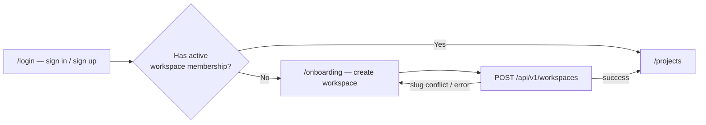
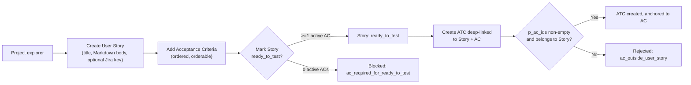
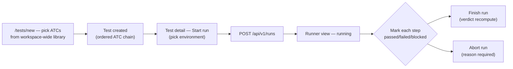
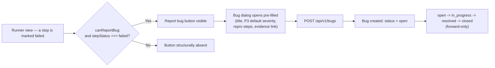
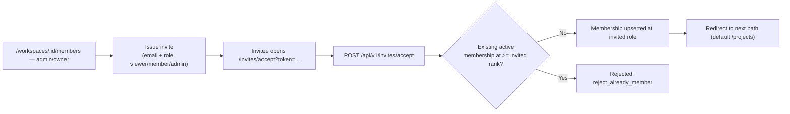
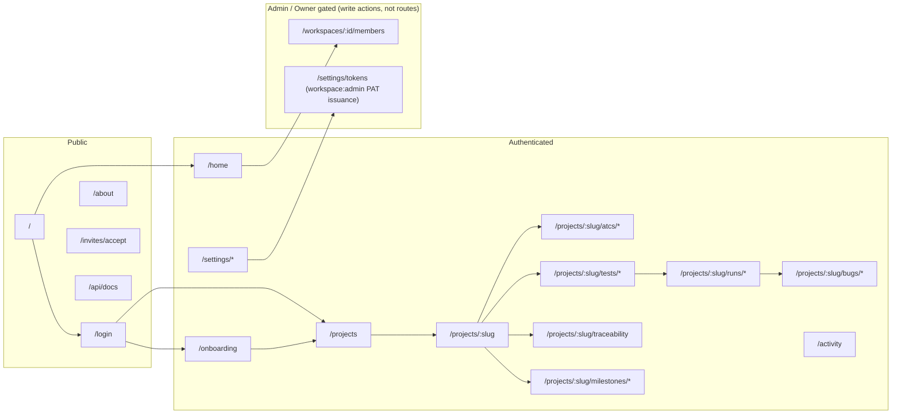

# User Journeys — Bunkai (upex-bunkai-tms)

> Discovery performed against `C:\Users\Genesis Ojose\Documents\Auto\Dojo 4\upex-bunkai-tms` (read-only), Next.js 15 App Router. Route inventory from `find app -name "page.tsx"`; protection boundary cross-referenced against `middleware.ts` (`PROTECTED_PREFIXES`). Per this repo's own `.context/project-config.md`, `qa/` and `design-tokens/` are dev-tooling routes and are excluded from journey mapping below (listed in the Route Map for completeness, flagged accordingly).

---

## 1. Route Map

### Public Routes (Unauthenticated)

| Route | Page | Purpose |
|---|---|---|
| `/` | `app/page.tsx` | Root entry — no UI of its own; redirects to `/home` if signed in, else `/login` (`RootEntryPage`, lines 11-15) |
| `/login` | `app/(auth)/login/page.tsx` | Sign-in (password, magic link, OAuth) + sign-up entry point; bounces signed-in users to `/projects` |
| `/about` | `app/about/page.tsx` | Public marketing/explainer page (no auth gate) — top-of-funnel content, pitch, capability matrix |
| `/invites/accept` | `app/invites/accept/page.tsx` | Public landing for invite-token redemption; reads `?token=` |
| `/api/docs` | `app/api/docs/page.tsx` | Public API documentation (OpenAPI-derived), linked from the About page's `Closing()` section |

**Dev-only routes (excluded from journey mapping, per `.context/project-config.md`)**: `/qa` (`app/qa/page.tsx`, "Software Testability Guide"), `/design-tokens` (`app/design-tokens/page.tsx`) — both are development/testability tooling, not product-facing user journeys.

### Protected Routes (Authenticated)

| Route | Page | Requires (role) | Purpose |
|---|---|---|---|
| `/home` | `app/(app)/home/page.tsx` | Any active member | Post-login dashboard landing (per `app/page.tsx` line 10, `BK-255`) |
| `/onboarding` | `app/(app)/onboarding/page.tsx` | Signed-in, zero active workspace memberships | First-workspace creation gate |
| `/projects` | `app/(app)/projects/page.tsx` | Any active member | Project list for the active workspace |
| `/projects/new` | `app/(app)/projects/new/page.tsx` | `>= member` (write gate) | Project creation |
| `/activity` | `app/(app)/activity/page.tsx` | Any active member | Workspace activity feed |
| `/settings`, `/settings/account`, `/settings/billing`, `/settings/notifications`, `/settings/tokens`, `/settings/workspaces` | `app/(app)/settings/**/page.tsx` | Any active member (mutations gated per-feature; PAT/`workspace:admin` issuance requires `admin`/`owner`) | Account, billing overview, notification prefs, PAT management, workspace switching |
| `/workspaces/[id]/members` | `app/(app)/workspaces/[id]/members/page.tsx` | Any active member to view; `admin`/`owner` to mutate | Member + invite management. **Not** in `middleware.ts`'s `PROTECTED_PREFIXES` matcher — protected instead by an explicit server-side `redirect('/login?next=...')` check inside the page itself (lines 13-16) |

### Dynamic Routes

| Pattern | Example | Purpose |
|---|---|---|
| `/projects/[projectSlug]` | `/projects/checkout` | Project home (explorer tree/table/mind-map) |
| `/projects/[projectSlug]/atcs/new` | `/projects/checkout/atcs/new?story=us1&ac=ac1` | New-ATC editor; `?story=`/`?ac=` deep-link pre-anchors to a Story/AC (`app/(app)/projects/[projectSlug]/atcs/new/page.tsx` lines 79-88) |
| `/projects/[projectSlug]/atcs/[atcId]` | `/projects/checkout/atcs/atc_123` | ATC detail/edit |
| `/projects/[projectSlug]/tests/new` | `/projects/checkout/tests/new` | New Test (ATC chain) builder |
| `/projects/[projectSlug]/tests/[testId]` | `/projects/checkout/tests/test_42` | Test detail — "Steps" tab; header carries the "Start run" affordance |
| `/projects/[projectSlug]/tests/[testId]/runs` | `/projects/checkout/tests/test_42/runs` | Run history for one Test |
| `/projects/[projectSlug]/runs/[runId]` | `/projects/checkout/runs/run_9` | Runner view — live per-step mark/abort/finish |
| `/projects/[projectSlug]/bugs/[bugId]` | `/projects/checkout/bugs/bug_7` | Bug detail/triage |
| `/projects/[projectSlug]/milestones/[milestoneId]` | `/projects/checkout/milestones/ms_1` | Milestone detail |
| `/workspaces/[id]/members` | `/workspaces/ws_1/members` | Members + invites for one workspace |

---

## 2. Journey 1 — Sign-Up & Workspace Onboarding

- **Persona**: any first-time user (becomes `owner` of the workspace they create)
- **Goal**: go from "no account" to "inside a project" in the fewest steps
- **Discovered From**: `app/(auth)/login/page.tsx`, `app/(app)/onboarding/page.tsx` + `onboarding-form.tsx`, `app/page.tsx`

### Step-by-Step Flow

| Step | Page | Action | Next | Evidence |
|---|---|---|---|---|
| 1 | `/login` | User authenticates via password, magic link, or GitHub/Google OAuth | `/projects` (redirect) | `app/(auth)/login/page.tsx:18-25` |
| 2 | `/projects` (server) | Server checks `workspace_members` for an active membership | `/onboarding` if none found | `app/(app)/onboarding/page.tsx:14-24` (mirrors the same no-workspace guard `/home` root redirect uses per `app/page.tsx:10`) |
| 3 | `/onboarding` | User fills workspace name; slug auto-derives (editable) | Submit | `app/(app)/onboarding/onboarding-form.tsx:59-74` |
| 4 | `/onboarding` | Form POSTs `{ slug, name }` to `/api/v1/workspaces` | Redirect to `/projects` on 2xx | `onboarding-form.tsx:89-106` |
| 5 | `/projects` | New workspace now has an active membership; project list renders (empty) | User creates first project | `app/(app)/projects/page.tsx` |

### Error Paths

| Error | Handling | Evidence |
|---|---|---|
| Slug already taken | Toast: `Slug "<slug>" is taken — try another.` (mapped from API's `conflict` error code) | `onboarding-form.tsx:97-98` |
| Empty workspace name | Client-side toast: `Enter a workspace name.`, focuses the name field | `onboarding-form.tsx:76-79` |
| Invalid slug (fails `SLUG_REGEX`) | Client-side toast: `Use at least 3 letters or digits — they become the URL slug.` | `onboarding-form.tsx:81-84` |
| Network error during submit | Toast shows the caught error message or `Network error.` | `onboarding-form.tsx:108-110` |

### Success Criteria

- [ ] Signed-in user with zero workspace memberships is redirected to `/onboarding`, not shown an empty `/projects` page.
- [ ] Submitting a valid name+slug creates a workspace and lands the user on `/projects` as its `owner`.
- [ ] A duplicate slug is rejected with the friendly conflict message, not a raw API error.

---

## 3. Journey 2 — Author a User Story and Anchor an ATC to It

- **Persona**: QA Engineer (`member`+)
- **Goal**: turn a requirement into at least one reusable, AC-anchored ATC
- **Discovered From**: `app/(app)/projects/[projectSlug]/user-story-form.tsx`, `app/(app)/projects/[projectSlug]/atcs/new/page.tsx`, `.context/business/domain-glossary.md` §3 (ATC anchoring rule)

### Step-by-Step Flow

| Step | Page | Action | Next | Evidence |
|---|---|---|---|---|
| 1 | Project explorer | User opens "New user story" form | Fill title/description/Jira key | `app/(app)/projects/[projectSlug]/user-story-form.tsx:130-188` |
| 2 | Story form | Submits Title (min 3 chars), Markdown Description (optional), optional Jira key | Story created in `draft` | `lib/user-stories/errors.ts:22-33` (title bounds) |
| 3 | Story detail | Adds one or more orderable Acceptance Criteria | AC list populated | `supabase/migrations/0017_acceptance_criteria_ordering.sql` |
| 4 | Story detail | Marks story `ready_to_test` | Gate checked | `supabase/migrations/0018_ready_to_test_gate_fn.sql:47-52` |
| 5 | Explorer, story row | Clicks "Create ATC" deep-link (`?story=<id>&ac=<id>`) | `/projects/[slug]/atcs/new?story=...&ac=...` | `app/(app)/projects/[projectSlug]/atcs/new/page.tsx:79-88` |
| 6 | ATC editor | Fills steps + assertions; AC pre-selected from the deep-link | Submit | `components/atcs/NewAtcEditor` |
| 7 | ATC editor | Submits with `p_ac_ids` non-empty, all belonging to the Story | ATC created, `atc_acceptance_criteria` link written | `supabase/migrations/0021_atc_create_update.sql:158-168,295-305` |

### Error Paths

| Error | Handling | Evidence |
|---|---|---|
| Marking `ready_to_test` with zero active ACs | Rejected, exception code `ac_required_for_ready_to_test`; story stays `draft` | `supabase/migrations/0018_ready_to_test_gate_fn.sql:47-52` |
| Creating an ATC with `p_ac_ids: []` or an AC from a different Story | Rejected: `"Every acceptance criterion must belong to the given user story."` (SQLSTATE `45020`) | `lib/atcs/errors.ts:16-19` |
| Story title too short/long | Client + RPC-mirrored bound validation | `lib/user-stories/errors.ts:22-33` |
| Deep-link points at foreign/stale story or AC id | Silently ignored — `initialStoryId`/`initialAcIds` only resolve against RLS-narrowed, in-project data; a stale param falls back to an empty picker, not an error | `app/(app)/projects/[projectSlug]/atcs/new/page.tsx:79-88` |

### Success Criteria

- [ ] A Story cannot reach `ready_to_test` with zero active ACs.
- [ ] An ATC cannot be created without at least one AC, and only ACs from its own Story are accepted.
- [ ] The explorer's "Create ATC" deep-link correctly pre-selects the Story/AC on the new-ATC form.

---

## 4. Journey 3 — Compose a Test Chain and Execute a Run

- **Persona**: QA Engineer (`member`+)
- **Goal**: assemble ATCs into an ordered Test, start a run, and record a per-step verdict
- **Discovered From**: `app/(app)/projects/[projectSlug]/tests/new/page.tsx`, `components/tests/StartRunButton.tsx`, `components/runs/RunnerView.tsx`, `lib/runs/mark-step-view.ts`

### Step-by-Step Flow

| Step | Page | Action | Next | Evidence |
|---|---|---|---|---|
| 1 | `/projects/[slug]/tests/new` | Picks ATCs from the workspace-wide (not just this project's) non-archived ATC library | Ordered chain built | `app/(app)/projects/[projectSlug]/tests/new/page.tsx:42-63` (comment: "Tests are WORKSPACE-scoped while ATCs are project-scoped") |
| 2 | Test builder | Submits chain via `NewTestBuilder` | Test created (`tests` + `test_steps` rows) | `supabase/migrations/0024_tests.sql` |
| 3 | `/tests/[testId]` | Clicks "Start run" in the header, picks an environment | `POST /api/v1/runs` | `components/tests/StartRunButton.tsx:57,132` |
| 4 | `/runs/[runId]` | Runner view opens `running`; realtime channel subscribed | Per-step controls visible (member+) | `components/runs/RunnerView.tsx:38,265` |
| 5 | Runner view | Marks a step `passed`/`failed`/`blocked` (re-marking always allowed, last-write-wins) | `POST /api/v1/runs/[id]/steps/[stepId]/mark` | `lib/runs/mark-step-view.ts:43-49`; `RunnerView.tsx:485` |
| 6 | Runner view | Finishes the run (verdict recomputed from step statuses) or aborts with a required reason | Run reaches a terminal status | `RunnerView.tsx:419` (finish), `RunnerView.tsx:370` (abort); `supabase/migrations/0036_run_abort.sql`, `0037_run_finish.sql` |

### Error Paths

| Error | Handling | Evidence |
|---|---|---|
| Marking a step on a run that already closed | UI shows the frozen guard copy in place of controls: `"This run is already closed and cannot accept new step results."` (also the RPC's own SQLSTATE `45212` message) | `lib/runs/mark-step-view.ts:22-26` |
| Marking as a `viewer` (no write access) | Controls are structurally absent (`showControls: false`), not merely disabled | `lib/runs/mark-step-view.ts:67-68` |
| Note exceeds max length | Field-specific message: `"Note must be at most <N> characters."` | `lib/runs/mark-step-view.ts:176-178` |
| Evidence link is not http(s) or too long | `"Evidence link must be a valid URL."` / `"Evidence link must be at most <N> characters."` | `lib/runs/mark-step-view.ts:184-189` |
| Removing an Environment still referenced by a Run | Blocked, preserving run history | `.context/business/domain-glossary.md` §3 (Additional rules table) |

### Success Criteria

- [ ] A Test's ATC chain can pull from any project in the workspace, not just the current one.
- [ ] Starting a run requires picking a Project Environment.
- [ ] Step marks are last-write-wins while `running`, and structurally blocked once the run is closed.
- [ ] Finish/abort transitions the run to a terminal status (`passed`/`failed`/`aborted`) that downstream reports can filter on.

---

## 5. Journey 4 — File a Bug from a Failed Run Step

- **Persona**: QA Engineer (`member`+)
- **Goal**: capture a defect without losing which ATC/step/run it came from
- **Discovered From**: `lib/runs/report-bug-view.ts`, `app/api/v1/bugs/route.ts`, `.context/business/domain-glossary.md` (Bug lifecycle)

### Step-by-Step Flow

| Step | Page | Action | Next | Evidence |
|---|---|---|---|---|
| 1 | Runner view | A step is marked `failed` | "Report bug" button appears, member+ only | `lib/runs/report-bug-view.ts:18-25` (`shouldShowReportBugButton`) |
| 2 | Bug dialog | Opens pre-filled: title = `"<ATC title> failed"`, severity = `P3` default, steps-to-reproduce = the executed step's content, evidence pre-seeded from the step's own evidence URL (only if it passes the same `isHttpUrl` gate the typed-input path uses) | User may edit any field | `lib/runs/report-bug-view.ts:27-76` (`buildReportBugPrefill`) |
| 3 | Bug dialog | Submits | `POST /api/v1/bugs` | `app/api/v1/bugs/route.ts` |
| 4 | Server | Validates step is actually `failed` (independent server-side re-check) | 201 or 422 | `lib/runs/report-bug-view.ts:17` comment referencing `run_step_not_failed` 422 |
| 5 | Bug detail | Bug created `open`, anchored to module + ATC + run + run_step | Bug appears in `/projects/[slug]/bugs` | `supabase/migrations/0046_bugs.sql` |
| 6 | Bug detail | Status advances one stage at a time: `open → in_progress → resolved → closed` | Never backward, never skips a stage | `.context/business/domain-glossary.md` §3 |

### Error Paths

| Error | Handling | Evidence |
|---|---|---|
| Reporting a bug on a step that is not (or no longer) `failed` | Server 422s with `run_step_not_failed`, even though the client button should have prevented this — independent re-enforcement | `lib/runs/report-bug-view.ts:14-17` |
| Skipping a bug-status stage (e.g. `open` → `resolved`) | `"A bug must move to '<nextStage>' first."` (SQLSTATE `45310`) | `lib/bugs/errors.ts:41-72` |
| Moving a bug backward | `"A bug's status cannot move backward."` (SQLSTATE `45311`) | `lib/bugs/errors.ts:41-72` |
| Assigning a bug to a `viewer` or inactive member | Rejected (SQLSTATE `45312`/`45313`) | `lib/bugs/errors.ts:73-83` |
| More than 10 evidence links | Rejected (SQLSTATE `45303`) | `lib/bugs/errors.ts:114-117` |
| Legacy non-http(s) stored evidence URL | Prefill silently drops it (empty evidence row) instead of seeding an unusable value that would 422 on submit | `lib/runs/report-bug-view.ts:53-65` (BK-500) |

### Success Criteria

- [ ] "Report bug" is only ever reachable from a `failed` step, for a member+ actor.
- [ ] The bug dialog pre-fills without requiring the tester to re-type context already captured by the run.
- [ ] Bug status cannot be forced backward or made to skip a stage, from any entry point.

---

## 6. Journey 5 — Invite and Onboard a Team Member

- **Persona**: `admin`/`owner` (inviter) + any new user (invitee)
- **Goal**: bring a teammate into the workspace at the correct privilege level
- **Discovered From**: `app/(app)/workspaces/[id]/members/page.tsx`, `app/invites/accept/page.tsx`, `lib/workspaces/invites.ts`

### Step-by-Step Flow

| Step | Page | Action | Next | Evidence |
|---|---|---|---|---|
| 1 | `/workspaces/[id]/members` | `admin`/`owner` issues an invite: email + role (never `owner` — excluded from the choices by the schema itself) | Invite row created | `app/(app)/workspaces/[id]/members/page.tsx`; `supabase/migrations/0010_workspace_invites.sql:18` (CHECK excludes `owner`) |
| 2 | Members list | Invite status derived client-side as `pending`/`accepted`/`revoked`/`expired` from `accepted_at`/`revoked_at`/`expires_at` | Row re-renders on refresh | `app/(app)/workspaces/[id]/members/page.tsx:68-73` (`derivedStatus`) |
| 3 | `/invites/accept?token=...` | Invitee (may be signed out) opens the link | `AcceptClient` reads the token as a prop, not a lingering URL param | `app/invites/accept/page.tsx:1-19` |
| 4 | Accept page | Client posts to `/api/v1/invites/accept` | Membership decided | `lib/workspaces/invites.ts:29-40` (`inviteAcceptAction`) |
| 5 | Accept page | On success, redirected to `next` (defaults to `/projects`) | Invitee lands inside the workspace at the invited role | `app/invites/accept/page.tsx:16` |

### Error Paths

| Error | Handling | Evidence |
|---|---|---|
| Invitee already holds an equal-or-higher-rank active membership | Accept rejected (`reject_already_member`) — never silently demotes | `lib/workspaces/invites.ts:29-40` |
| Attempting to invite at `owner` rank | Structurally impossible — `workspace_invites.role` CHECK constraint excludes it | `supabase/migrations/0010_workspace_invites.sql:18` |
| Expired invite token | Derived `expired` status shown in the members list before the invitee even tries; accept-time behavior for an already-expired token not directly observed in this pass | `app/(app)/workspaces/[id]/members/page.tsx:71` (derivation only — flagged, see Discovery Gaps) |
| Invitee not signed in when opening the accept link | Not directly observed in this pass — `AcceptClient`'s internal auth handling was not read | Flagged — see Discovery Gaps |

### Success Criteria

- [ ] An invite can never be issued at `owner` rank.
- [ ] Accepting an invite never demotes an existing higher-or-equal-rank membership.
- [ ] A successful accept lands the invitee inside the workspace at exactly the invited role.

---

## 7. Navigation Structure

Note: `Members` is reachable by any active member (read) but its mutating actions require `admin`/`owner` — it is a role-gated *action* surface, not a route-level admin section (no `/admin` route prefix exists in this codebase).

---

## 8. Breadcrumb Patterns

A single generic `Breadcrumb` component (`components/layout/Topbar.tsx:26-51`) renders an `items: string[]` array joined with `/`, the last segment bold. Concrete usage found in the project shell:

| Path | Breadcrumb |
|---|---|
| `/projects/[projectSlug]/*` | `<Workspace name> / <Project name> / <Section label>` (`app/(app)/projects/[projectSlug]/project-shell.tsx:85`) |

Other usages of `Breadcrumb` were found in `move-module-dialog.tsx`, `project-explorer.tsx`, `rename-module-form.tsx`, `AtcEditor.tsx`, `AtcPreview.tsx`, `NewAtcEditor.tsx`, and `RunnerView.tsx` but their exact `items` arrays were not individually read in this pass — the three-level `Workspace / Project / Section` shape above is confirmed for the project shell; deeper nesting (e.g. down to a specific ATC or Run) is likely but not independently verified per-component.

---

## 9. Critical Paths

### Happy Paths (Must Work)

| Journey | Start | End | Business Impact |
|---|---|---|---|
| Sign-up & Onboarding | `/login` | `/projects` with an active workspace | Zero-workspace users cannot use the product at all until this completes — total blocker if broken |
| Story → ATC authoring | Project explorer | ATC created, anchored to an AC | This is the product's structural core claim ("un ATC sin historia de usuario no puede existir") — if this breaks, the entire value prop is void |
| Test → Run execution | `/tests/new` | Run reaches a terminal status | The only way any Test produces a result; blocks all downstream coverage/traceability reporting |
| Bug filing from a failed step | Runner view | Bug created, anchored to run/ATC/step | Core differentiator vs. "bugs leave the QA loop" — a regression here silently reverts to the pain the product exists to fix |
| Invite → Accept | `/workspaces/:id/members` | Invitee active in workspace at correct role | Team growth blocker if broken; also the only path an `admin`/`owner` besides the creator ever gets provisioned |

### Unhappy Paths (Must Handle)

| Scenario | Expected Behavior | Evidence |
|---|---|---|
| `viewer` attempts any content mutation | Blocked server-side (`forbidden`) and the control never renders client-side | `lib/*/errors.ts` write gates; `lib/runs/mark-step-view.ts:67-68` |
| ATC created without an AC | Rejected, no row written | `supabase/migrations/0021_atc_create_update.sql:158-168` |
| Bug status transition out of sequence | Rejected, forward-only enforced | `lib/bugs/errors.ts:41-72` |
| Marking a step on a closed run | Structurally blocked, frozen guard copy shown | `lib/runs/mark-step-view.ts:22-26` |
| Duplicate workspace slug at creation | Friendly conflict toast, no workspace created | `onboarding-form.tsx:97-98` |
| Invite-accept that would demote an existing member | Rejected outright | `lib/workspaces/invites.ts:29-40` |

---

## 10. Discovery Gaps

| Flow | Unknown | Question |
|---|---|---|
| Invite accept when invitee is signed out | `AcceptClient`'s internal sign-in-then-accept handling was not read in this pass | Does `/invites/accept` redirect through `/login` first, or does it collect credentials inline? |
| Expired-token accept attempt | Only the members-list *display* derivation (`expired`) was confirmed; the accept endpoint's own behavior on an actually-expired token was not independently verified | Does `/api/v1/invites/accept` return a distinct error code for expired vs. revoked vs. already-accepted? |
| Jira import flow (`app/(app)/projects/[projectSlug]/import-from-jira-dialog.tsx`) | File located but its step-by-step UI flow was not read in this pass — omitted from the 5 journeys above to stay within the doctrine cap, not because it is unimportant | Worth a dedicated follow-up journey given it's a headline capability (`lib/jira/import-runner.ts`) |
| Deeper breadcrumb nesting (down to ATC/Run detail) | Only the `Workspace / Project / Section` three-level pattern was confirmed; per-page `items` arrays for ATC/Run/Test detail were not individually read | Read `AtcEditor.tsx`, `RunnerView.tsx` breadcrumb call sites directly if breadcrumb QA coverage is needed |
| OAuth (GitHub/Google) callback error handling | `oauth-buttons.tsx` / `lib/auth/oauth.ts` referenced elsewhere in this repo's own discovery but not re-read for this journey's error-path table | Confirm the exact toast/redirect behavior on OAuth denial or provider error |

---

## 11. QA Relevance

### Critical E2E Test Scenarios

| Priority | Scenario | Journey Reference |
|---|---|---|
| P0 | New user signs up, creates a workspace, and lands in `/projects` as `owner` | Journey 1 |
| P0 | ATC creation is rejected with zero or foreign ACs; accepted with a valid same-story AC | Journey 2 |
| P0 | Full Test → Run → mark-step → finish loop reaches a terminal status matching the step verdicts | Journey 3 |
| P0 | Bug filed from a failed step carries the correct ATC/run/step anchor and pre-fill | Journey 4 |
| P1 | `viewer` cannot perform any mutating action across all 5 journeys (RBAC negative sweep) | All |
| P1 | Bug status cannot skip a stage or move backward, from the UI and via direct API call | Journey 4 |
| P1 | Invite-accept never demotes an existing higher-rank member | Journey 5 |
| P2 | Workspace slug conflict shows the friendly toast, not a raw API error | Journey 1 |
| P2 | Deep-linked "Create ATC" correctly pre-selects Story/AC from query params | Journey 2 |
| P2 | Evidence-link validation (http/https only, length bound) matches between client and server on both the mark-step and bug-report entry points | Journeys 3, 4 |

### Suggested Test Data

| Journey | Test User | Prerequisites |
|---|---|---|
| Journey 1 | Fresh account, zero memberships | None — this is the entry state |
| Journey 2 | `member`+ in a workspace with at least one Project | A Project + Module must already exist |
| Journey 3 | `member`+ with at least one ATC available | ATC library non-empty; at least one Project Environment configured |
| Journey 4 | `member`+ mid-run with a step already `failed` | An active Run with a failed step |
| Journey 5 | `admin`/`owner` (inviter) + a second fresh account (invitee) | Two distinct user identities — see `.context/PRD/user-personas.md` §9 for the per-role test-account gap this exposes |
