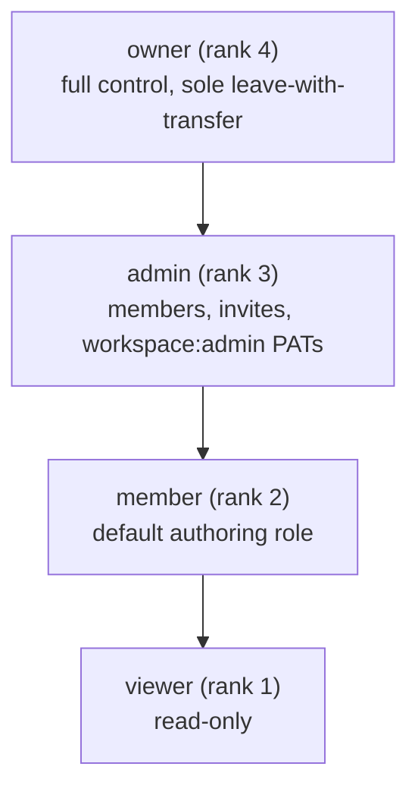

# User Personas — Bunkai (upex-bunkai-tms)

> Discovery performed against `C:\Users\Genesis Ojose\Documents\Auto\Dojo 4\upex-bunkai-tms` (read-only). Personas below are the roles the system already recognizes via `workspace_members.role` / `workspace_invites.role` (`lib/types.ts:13`, `supabase/migrations/0001_tenancy.sql:44`), not invented demographic personas — per doctrine, the code's own authorization model is the source of truth. Primary reference: `.context/business/domain-glossary.md` §2 (`MemberRole` enum) and §3 (Business Rules).

---

## 1. Persona Discovery Summary

| Persona | System Role | Access Level | Primary Goal |
|---|---|---|---|
| Workspace Owner | `owner` | Full control; sole role with leave-with-transfer semantics | Stand up and govern the workspace as the accountable tenant admin |
| Workspace/QA Admin | `admin` | Manage members + invites; issue `workspace:admin`-scoped PATs; full authoring/execution rights | Run the QA process day-to-day: membership, tokens, process governance |
| QA Engineer (Member) | `member` | Full authoring/execution rights on content (stories, ATCs, tests, runs, bugs); no membership/token administration | Author requirements and ATCs, execute runs, file bugs |
| Viewer / Stakeholder | `viewer` | Read-only across the workspace's projects and results | Track coverage, run history, and defect status without editing anything |

*4 personas — the full width of the `MemberRole` enum (`viewer` \| `member` \| `admin` \| `owner`). None invented; none collapsed, since each rank gates a materially different set of mutations (see Permission Matrix, §4).*

---

## 2. Persona: Workspace Owner

### Identity

- System Role: `owner` (`role_value: 'owner'`)
- Evidence: `supabase/migrations/0001_tenancy.sql` (`workspaces.owner_user_id`, one owner per workspace); `lib/workspaces/invites.ts:9-14` (`ROLE_RANK.owner = 4`, highest rank)
- Access Level: Full control — the only role that can leave a workspace with transfer semantics, and the only membership row a workspace's own `owner_user_id` FK can point at.
- Estimated % of Users: Unknown — no usage telemetry exists to estimate this (see Discovery Gaps).

### Goals (Inferred from Features)

| Goal | Supporting Feature | Route/Component |
|---|---|---|
| Stand up a new tenant boundary for the team | Workspace creation on first login | `app/(app)/onboarding/onboarding-form.tsx` (POST `/api/v1/workspaces`) |
| Govern who has access and at what privilege | Members & invites management | `app/(app)/workspaces/[id]/members/page.tsx` |
| Issue high-privilege automation credentials | `workspace:admin`-scoped PAT issuance | `lib/api/pat.ts:29-84` |
| Monitor seat/project usage against the plan tier | Read-only billing/usage overview | `app/(app)/settings/billing/page.tsx`, `lib/billing/plan-tiers.ts` |

### Pain Points (Inferred from Validation/Errors)

| Pain Point | Evidence |
|---|---|
| Accidentally demoting themselves via an invite accept that carries a lower role | `inviteAcceptAction` in `lib/workspaces/invites.ts:29-40` rejects the accept ("reject_already_member") rather than silently demoting — implies this was a real risk the code guards against |
| Losing sole ownership without a deliberate transfer | `isSoleOwner` check in `lib/account/workspaces.ts:91` (`role === 'owner' && ownerCounts[...] === 1`) — surfaced so the UI can block/guard a sole-owner leaving |

### Feature Access

| Feature | Access | Evidence |
|---|---|---|
| Workspace creation | Full (any authenticated user becomes `owner` of what they create) | `app/(app)/onboarding/onboarding-form.tsx` |
| Member/invite management | Full | `app/(app)/workspaces/[id]/members/page.tsx` |
| `workspace:admin` PAT issuance | Full | `lib/api/pat.ts:81-84` (`['admin','owner'].includes(membership.role)`) |
| All content authoring (stories, ATCs, tests, runs, bugs) | Full | Content-write gates check `>= member`, which `owner` always satisfies |

### User Journey Summary

`Sign up → create workspace → create first project → invite team → govern membership/tokens`

### Profile Attributes (from `WorkspaceMember` / `User` entity, `.context/business/domain-glossary.md` §1)

- `workspace_id`, `user_id`, `role: 'owner'`, `status: 'active' | 'invited' | 'suspended'`, `joined_at`
- Sourced from Supabase Auth `user` (email; no separate app-level profile table found)

### Representative Quote (inferred)

> "I need to know exactly who can touch this workspace and revoke it the moment someone leaves the team." *(inferred — not a literal in-product string; consistent with the members/invites feature surface.)*

---

## 3. Persona: Workspace/QA Admin

### Identity

- System Role: `admin` (`role_value: 'admin'`)
- Evidence: `lib/workspaces/invites.ts:9-14` (`ROLE_RANK.admin = 3`); `supabase/migrations/0010_workspace_invites.sql:18` (`workspace_invites.role` CHECK allows `viewer`/`member`/`admin` — never `owner` via invite)
- Access Level: Membership + token administration, plus full content authoring/execution. Cannot transfer/dissolve workspace ownership.
- Estimated % of Users: Unknown (no telemetry).

### Goals (Inferred from Features)

| Goal | Supporting Feature | Route/Component |
|---|---|---|
| Onboard new teammates at the right privilege level | Invite issuance (`viewer`/`member`/`admin`) | `app/(app)/workspaces/[id]/members/page.tsx` |
| Issue scoped automation credentials for CI/agent use | PAT issuance (all scopes except being blocked from `workspace:admin` by rank) | `lib/api/pat.ts` |
| Own the QA process end-to-end without owner bottleneck | Full read/write on stories, ATCs, tests, runs, bugs | Content routes under `app/(app)/projects/[projectSlug]/` |

### Pain Points (Inferred from Validation/Errors)

| Pain Point | Evidence |
|---|---|
| Trying to grant an invite at `owner` rank | `workspace_invites.role` CHECK constraint rejects `owner` at the schema level (`supabase/migrations/0010_workspace_invites.sql:18`) — an invite can never grant ownership, so an admin's invite UI structurally cannot offer it |
| Being blocked from issuing a `workspace:admin` PAT for someone else's workspace | `lib/api/pat.ts:79`: `"You are not a member of the target workspace."` |

### Feature Access

| Feature | Access | Evidence |
|---|---|---|
| Member/invite management | Full | `app/(app)/workspaces/[id]/members/page.tsx` |
| `workspace:admin` PAT issuance (own workspace only) | Full | `lib/api/pat.ts:81-84` |
| Workspace deletion / ownership transfer | None | No route/RPC found granting this outside `owner` |
| All content authoring/execution | Full | Same `>= member` gates as Owner |

### User Journey Summary

`Accept invite (or created by) → manage members/tokens → author + execute QA work`

### Profile Attributes

- `workspace_id`, `user_id`, `role: 'admin'`, `status`, `joined_at` (same `WorkspaceMember` shape as Owner)

### Representative Quote (inferred)

> "I own getting new hires access without waiting on the workspace owner for every single invite." *(inferred)*

---

## 4. Persona: QA Engineer (Member)

### Identity

- System Role: `member` (`role_value: 'member'`)
- Evidence: `lib/workspaces/invites.ts:9-14` (`ROLE_RANK.member = 2`); described in the target's own glossary as the "default authoring role"
- Access Level: Full read/write on requirements, ATCs, tests, runs, bugs. No membership or token administration.

### Goals (Inferred from Features)

| Goal | Supporting Feature | Route/Component |
|---|---|---|
| Author requirements and break them into testable criteria | User Story + Acceptance Criteria authoring | `app/(app)/projects/[projectSlug]/user-story-form.tsx` |
| Build a reusable ATC library anchored to acceptance criteria | ATC builder (steps + assertions) | `app/(app)/projects/[projectSlug]/atcs/new/page.tsx`, `components/atcs/NewAtcEditor` |
| Compose ATCs into ordered test chains | Test builder | `app/(app)/projects/[projectSlug]/tests/new/page.tsx`, `components/tests/NewTestBuilder` |
| Execute a run and record a verdict per step | Runner view, manual run | `components/runs/RunnerView.tsx`, `components/tests/StartRunButton.tsx` |
| File a bug without losing execution context | Report-bug-from-failed-step flow | `lib/runs/report-bug-view.ts`, `app/api/v1/bugs/route.ts` |

### Pain Points (Inferred from Validation/Errors)

| Pain Point | Evidence |
|---|---|
| Trying to create an ATC not anchored to any Acceptance Criterion | `"Every acceptance criterion must belong to the given user story."` — `lib/atcs/errors.ts:16-19`, SQLSTATE `45020` |
| Trying to mark a User Story `ready_to_test` with zero active ACs | RPC raises `ac_required_for_ready_to_test` (SQLSTATE `45010`) — `supabase/migrations/0018_ready_to_test_gate_fn.sql:47-52` |
| Trying to mark a step on a run that already closed | `"This run is already closed and cannot accept new step results."` — `lib/runs/mark-step-view.ts:26` |
| Trying to advance a bug's status out of sequence | `"A bug must move to '<nextStage>' first."` (SQLSTATE `45310`) / `"A bug's status cannot move backward."` (SQLSTATE `45311`) — `lib/bugs/errors.ts:41-72` |
| Writing to content in a workspace they're not an active member of | `"You must be a member of this workspace with write access."` — repeated verbatim across `lib/atcs/errors.ts:9`, `lib/bugs/errors.ts:26`, `lib/environments/errors.ts:42`, `lib/milestones/errors.ts:20`, `lib/runs/errors.ts:14` |

### Feature Access

| Feature | Access | Evidence |
|---|---|---|
| Story/AC/ATC/Test authoring | Full | Content-write gates require `>= member` |
| Run execution (mark step, abort, finish) | Full | `components/runs/RunnerView.tsx`; `lib/runs/mark-step-view.ts` |
| Bug filing/triage | Full | `app/api/v1/bugs/route.ts` |
| Member/invite management | None | No UI entry point found; `app/(app)/workspaces/[id]/members/page.tsx` is reachable by URL but its mutating actions gate on `admin`/`owner` server-side |
| PAT issuance beyond default headless scopes | None (default scopes only: `atc:read`, `atc:write`, `run:execute`) | `lib/api/pat.ts:17-84` (`workspace:admin` excluded from headless-auth defaults) |

### User Journey Summary

`Author story + AC → build ATC(s) → compose test chain → start + execute run → (on failure) file bug in context`

### Profile Attributes

- `workspace_id`, `user_id`, `role: 'member'`, `status`, `joined_at`

### Representative Quote (inferred)

> "I write the ATC once. I don't want to remember which forty tests also reference it." *(inferred — directly consistent with the product's own `PainSolution()` pitch, `app/about/_components/sections.tsx` lines 100-104.)*

---

## 5. Persona: Viewer / Stakeholder

### Identity

- System Role: `viewer` (`role_value: 'viewer'`)
- Evidence: `lib/workspaces/invites.ts:9-14` (`ROLE_RANK.viewer = 1`, lowest rank)
- Access Level: Read-only. RLS narrows every select to the caller's own workspace memberships regardless of role; role gates only mutations.

### Goals (Inferred from Features)

| Goal | Supporting Feature | Route/Component |
|---|---|---|
| Track coverage and traceability without editing anything | Traceability + coverage reporting | `app/(app)/projects/[projectSlug]/traceability/page.tsx` |
| Check run history and defect status | Run history, bug list | `app/(app)/projects/[projectSlug]/runs/page.tsx`, `app/(app)/projects/[projectSlug]/bugs/page.tsx` |

### Pain Points (Inferred from Validation/Errors)

| Pain Point | Evidence |
|---|---|
| Attempting any mutating action (mark step, file bug, create ATC) | Blocked by the same `"You must be a member of this workspace with write access."` gate — the message does not distinguish "not a member" from "member but insufficient rank," so a `viewer` and a non-member see identical copy | `lib/bugs/errors.ts:26` and siblings cited above |
| "Report bug" control never appearing on a run they're watching | `shouldShowReportBugButton` requires `canReportBug` (member+) — for a `viewer` this evaluates false and the control is structurally absent, not merely disabled | `lib/runs/report-bug-view.ts:23-25` |

### Feature Access

| Feature | Access | Evidence |
|---|---|---|
| Read: projects, stories, ATCs, tests, runs, bugs, traceability, coverage | Full | RLS-scoped selects; no role check on GET routes beyond workspace membership |
| Write: any content mutation | None | `>= member` gates on every write route cited above |

### User Journey Summary

`Sign in → open a project → read coverage/run history/bug list (no edits)`

### Profile Attributes

- `workspace_id`, `user_id`, `role: 'viewer'`, `status`, `joined_at`

### Representative Quote (inferred)

> "I just need to see where coverage stands before the release call — I'm not the one editing tests." *(inferred)*

---

## 6. Role Hierarchy

Verified directly from code, not inferred from enum declaration order alone: `ROLE_RANK` in `lib/workspaces/invites.ts:9-14` explicitly assigns `viewer: 1, member: 2, admin: 3, owner: 4` and this rank is used to decide whether accepting an invite would demote the caller (`inviteAcceptAction`, same file, lines 29-40).

---

## 7. Permission Matrix

| Permission | `owner` | `admin` | `member` | `viewer` |
|---|---|---|---|---|
| Create/edit workspace | ✓ | ✗ | ✗ | ✗ |
| Manage members/invites | ✓ | ✓ | ✗ | ✗ |
| Issue `workspace:admin` PAT | ✓ | ✓ | ✗ | ✗ |
| Issue default-scope PAT (`atc:read`/`atc:write`/`run:execute`) | ✓ | ✓ | ✓ | ✗ (write scopes gated by write access) |
| Create/edit projects, modules, stories, ACs, ATCs, tests | ✓ | ✓ | ✓ | ✗ |
| Start/mark/abort/finish a run | ✓ | ✓ | ✓ | ✗ |
| File/triage a bug | ✓ | ✓ | ✓ | ✗ |
| Read projects/stories/ATCs/tests/runs/bugs/coverage | ✓ | ✓ | ✓ | ✓ |
| Leave workspace with ownership transfer | ✓ (only role) | ✗ | ✗ | ✗ |

*Evidence: write gates cited per-persona above (`lib/*/errors.ts` "You must be a member of this workspace with write access."); PAT scope gates `lib/api/pat.ts:29-84`; membership/invite gates `app/(app)/workspaces/[id]/members/page.tsx` + `lib/workspaces/invites.ts`; sole-owner leave gate `lib/account/workspaces.ts:91`.*

---

## 8. Discovery Gaps

| Gap | Why It Matters | Question to Ask |
|---|---|---|
| Estimated % of users per role | Cannot prioritize QA effort by role-weighted usage without this | Ask the team, or instrument role-distribution telemetry (currently none exists) |
| Whether `viewer` is a real paid-seat-consuming role or a free "read-only guest" concept | Affects both billing QA (seat-count boundary tests) and RBAC QA scope | Check `lib/billing/plan-tiers.ts` seat-counting logic against whether `viewer` rows count toward `seatLimit` — not verified in this pass |
| Distinct UI copy difference for "not a member" vs. "member but insufficient rank" | The identical `"You must be a member of this workspace with write access."` message for both cases is a possible UX/security-disclosure design choice, not confirmed intentional | Confirm with the team whether this ambiguity is deliberate (mirrors the Bug 404 non-disclosure pattern documented in the domain glossary) |

---

## 9. QA Relevance

### Test Account Requirements

| Persona | Test Account | Permissions Needed |
|---|---|---|
| Workspace Owner | Not present. This boilerplate's own `.env` currently ships `LOCAL_USER_EMAIL` / `STAGING_USER_EMAIL` (and matching `_PASSWORD`) with **no role suffix** — a single generic identity, not one per role — and those two keys are currently **empty** in this repo's `.env` | Needs creation: a dedicated `owner`-role account per environment |
| Workspace/QA Admin | Not present — same gap | Needs creation: a dedicated `admin`-role account per environment |
| QA Engineer (Member) | Partially covered by the existing generic `LOCAL_USER_EMAIL`/`STAGING_USER_EMAIL` pattern IF that account happens to hold `member` rank in the target workspace — role is not guaranteed by the variable name alone | Needs confirmation of actual role, or a renamed/role-suffixed variable (`LOCAL_MEMBER_EMAIL`, per this repo's own `.agents/project.yaml` → `testing.automation_identity` override mechanism) |
| Viewer / Stakeholder | Not present | Needs creation: a dedicated `viewer`-role account per environment |

The target repo's own `.env.example` separately defines a single `QA_E2E_USER_EMAIL` / `QA_E2E_USER_PASSWORD` pair for its own `/sprint-development` live-UI automation identity (`upex-bunkai-tms/.env.example` lines 166-167) — also generic, no role suffix. Neither repo's env template currently supports a per-role test-account matrix; this is a real gap for RBAC-negative test coverage (see Permission Matrix, §7), which needs at least one account per role to execute.

### Critical Persona Flows to Test

- Owner: sole-owner leave-block, ownership-adjacent settings (billing overview visibility).
- Admin: invite issuance capped below `owner` rank, `workspace:admin` PAT issuance.
- Member: full authoring→execution→bug-filing loop, including every negative case enumerated in Pain Points above.
- Viewer: every write attempt across every entity returns the same `forbidden` gate, and no write control renders in the UI (not merely disabled).

### Edge Cases by Persona

- A `viewer` account with a role rank change mid-session (e.g. promoted while their run report was still open) — no evidence found either way; likely worth a Discovery-Gap-driven exploratory session.
- Invite-accept that would demote an existing member — `inviteAcceptAction`'s `reject_already_member` branch (`lib/workspaces/invites.ts:29-40`) is a concrete negative test case ready to drop into an ATP.
