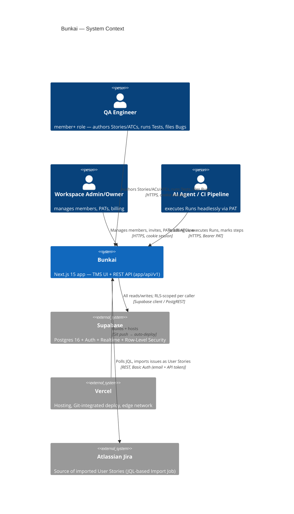
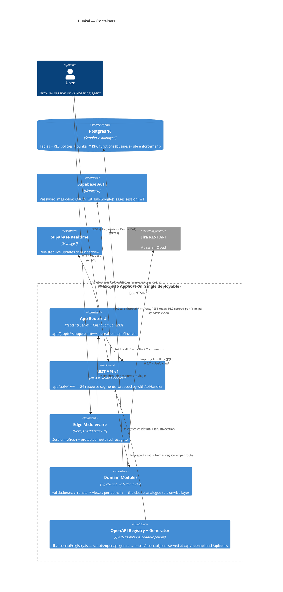
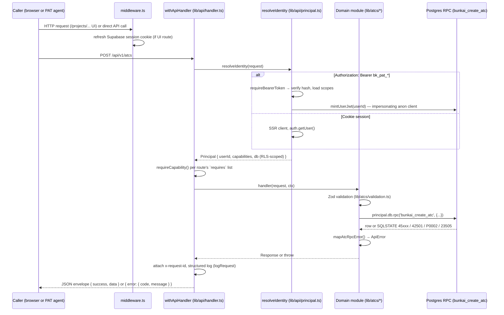
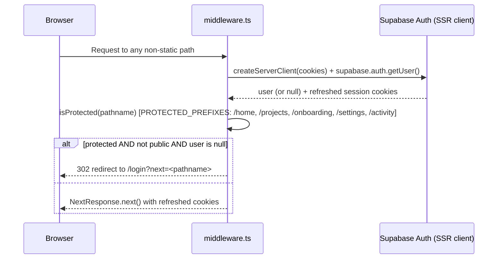

# Architecture — Bunkai (upex-bunkai-tms)

> Discovery performed against `C:\Users\Genesis Ojose\Documents\Auto\Dojo 4\upex-bunkai-tms` (read-only). Cross-references `.context/business/domain-glossary.md` (entity/enum/state authority — not rebuilt here) and `.context/project-config.md` (tech stack summary). Phase 2 SRS runs after Phase 2 PRD; scope is the same 5 journeys already mapped in `.context/PRD/user-journeys.md`.

---

## 1. System Overview

| Aspect | Value | Evidence |
|---|---|---|
| Pattern | **Feature-based modular monolith** — a single Next.js 15 app where `app/api/v1/**` (route handlers) and `app/(app)/**` (UI) share one codebase; domain logic is factored into per-feature modules under `lib/<domain>/` (e.g. `lib/atcs/`, `lib/bugs/`, `lib/runs/`, `lib/workspaces/`), not a layered MVC or hexagonal split | `lib/` directory listing: 27 domain folders (`acceptance-criteria`, `atcs`, `bugs`, `runs`, `tests`, `workspaces`, `jira`, `billing`, `traceability`, …), each self-contained with its own `validation.ts`/`errors.ts`/`*-view.ts`/`*.test.ts` |
| Frontend framework | Next.js 15 App Router, React 19, TypeScript | `.context/project-config.md`; `app/` dir, no `pages/` |
| Backend | Next.js Route Handlers under `app/api/v1/**` — no separate backend service | `.context/project-config.md`; confirmed 24 resource segments under `app/api/v1/` (see §3) |
| Data access | No ORM — direct `@supabase/supabase-js` / `@supabase/ssr` calls, funneled through `lib/supabase/{client,server,admin,rpc}.ts` | `.context/project-config.md`; `lib/supabase/` listing |
| Database | PostgreSQL 16 via Supabase, single project shared across local/staging/production (`fmbpikzpkafptqximhxn`) | `.context/project-config.md` |
| Styling | Tailwind CSS 3.4 + shadcn/ui | `package.json` (`tailwindcss`, `class-variance-authority`, `@radix-ui/*`) |
| Deployment | Vercel, zero-config Git integration; no `vercel.json` | `.context/project-config.md` |
| Domain-rule enforcement | Business invariants live in Postgres RPCs (`bunkai_*` functions, `SQLSTATE 45xxx` custom codes) called from `lib/*/errors.ts` mappers, not in application-layer service classes | `lib/atcs/errors.ts`, `lib/bugs/errors.ts` (see §4 Data Flow), `.context/business/domain-glossary.md` §3 |

**Architecture-pattern note**: this is not a classic "service layer" architecture. The closest analogue to a "service method" is a `lib/<domain>/errors.ts` + `validation.ts` pair around a Postgres RPC call — the RPC is the actual unit of business logic and transactional integrity (see ADR-0012 `rpc-authorization-invariant`, `upex-bunkai-tms/.context/ADR/`). This shapes how `functional-specs.md` derives FR entries: "service method" in that document means "route handler + its RPC + its error mapper," not a `*Service.ts` class.

---

## 2. C4 Context Diagram

## 3. C4 Container Diagram

---

## 4. Component Structure

| Directory | Responsibility | Notes |
|---|---|---|
| `app/(app)/**` | Authenticated UI pages (Server Components + client islands) | Route-per-feature: `projects/[slug]/atcs`, `tests`, `runs`, `bugs`, `milestones` |
| `app/(auth)/**` | Sign-in/sign-up UI | Password, magic-link, OAuth entry |
| `app/about`, `app/invites`, `app/api/docs` | Public routes | Marketing, invite-accept, OpenAPI-derived docs (Scalar) |
| `app/qa`, `app/design-tokens` | Dev-only tooling routes | Excluded from journey mapping per `.context/PRD/user-journeys.md` |
| `app/api/v1/**` | REST API — 24 resource segments (workspaces, projects, modules, user-stories, acceptance-criteria, atcs, atcs/search, tests, runs, bugs, milestones, environments, imports, invites, tokens, notifications, notification-preferences, activity, search, me, auth/*, health) | Every route wrapped by `withApiHandler` (`lib/api/handler.ts`) |
| `app/api/openapi` | Serves generated `public/openapi.json`, `force-static`, 5-min cache | `app/api/openapi/route.ts` |
| `lib/supabase/` | Data-access helpers: `client.ts` (browser), `server.ts` (SSR cookie session), `admin.ts` (service-role, bypasses RLS), `rpc.ts` (typed RPC caller), `with-workspace.ts` | Single funnel point for all DB access |
| `lib/api/` | Cross-cutting API concerns: `handler.ts` (auth posture + logging + error mapping), `principal.ts` (identity resolution), `idempotency.ts`, `capabilities.ts` (PAT scope vocabulary), `error-envelope.ts`, `logging.ts`, `request-id.ts`, `middleware/bearer.ts` | The API's own "framework" layer |
| `lib/<domain>/` (27 folders) | Per-entity validation, error mapping, view-model composition | e.g. `lib/atcs/{validation,errors,sanitize,optimistic-lock,builder-guards}.ts`; each domain typically ships a `.test.ts` sibling per file (heavy co-located test coverage — see Discovery Gaps re: no CI to run them) |
| `lib/jira/` | Jira Import Job: `client.ts` (REST + retry/backoff), `import-runner.ts`, `extract-acceptance-criteria.ts`, `adf-to-markdown.ts` | External-integration boundary |
| `lib/openapi/registry.ts` | Central zod-to-openapi registry consumed by `scripts/openapi-gen.ts` | Source of truth for `public/openapi.json` |
| `components/<domain>/` | React components mirroring `lib/` domain names (`atcs/`, `bugs/`, `runs/`, `tests/`, `traceability/`, `metrics/`, `coverage/`) | 1:1-ish pairing with domain lib folders |
| `supabase/migrations/` | 73+ SQL migration files — schema + RLS policies + `bunkai_*` RPC functions | Ground truth for schema and business rules (see `domain-glossary.md`) |
| `middleware.ts` | Session refresh + protected-route gate | See §5 Auth Sequence |

---

## 5. Database Schema

**This document does not rebuild the entity list or ERD** — both already exist, code-verified, in `.context/business/domain-glossary.md` §1 (28 core entities, full attribute tables, `Found In` citations) and §4 (15-entity `erDiagram`, FK relationships, PK/FK column detail). Refer there for entity definitions, cardinalities, and JSON examples.

This section adds only what that document does not cover: indexes, unique constraints, and RPC-function inventory.

### Constraints and indexes found in this pass

| Table | Constraint | Type | Evidence |
|---|---|---|---|
| `user_stories` | Partial unique index on `(project_id, external_id)` | Prevents the same Jira issue linking to two Stories in one project | `lib/user-stories/errors.ts:8-13` (23505 mapped to `external_id_duplicate`), `supabase/migrations/0016_user_story_uniqueness.sql` (per domain-glossary §1) |
| `atcs` | Unique on `(project_id, slug)` | 23505 mapped to `slug_collision`, auto-retry-generate on collision | `lib/atcs/errors.ts:39-42` |
| `idempotency_keys` | Unique on `(user_id, endpoint, key)` | Enforces one row per idempotent-request identity; concurrent duplicate insert loses the race → 409 | `lib/api/idempotency.ts:143-150` |
| `idempotency_keys` | FK `workspace_id → workspaces.id` | A caller-supplied nonexistent `workspace_id` is caught here (23503) before the business RPC's own membership check runs | `lib/api/idempotency.ts:151-172` |
| `access_tokens.scopes` | CHECK constraint admitting exactly 4 values | `atc:read`, `atc:write`, `run:execute`, `workspace:admin` | `lib/api/capabilities.ts:26-31` ("Keep in sync with the `scopes` CHECK in migration 0008_access_tokens.sql") |
| `atcs` (tags) | RPC-level backstop cap of 10 tags (migration 0065) | Client-side Zod `.max(MAX_ATC_TAGS)` is primary; RPC SQLSTATE `45024` is the backstop | `lib/atcs/errors.ts:43-50`; also in domain-glossary §3 |

### RPC function inventory (business logic entry points)

The application never writes multi-table domain mutations directly through PostgREST — it calls named `bunkai_*` Postgres functions that enforce invariants transactionally. Confirmed call sites in this pass:

| RPC (prefix `bunkai_`) | Domain | Custom SQLSTATE range | Evidence |
|---|---|---|---|
| `create_atc` / `update_atc` / `get_atc` | ATC | `45020`–`45024` | `lib/atcs/errors.ts` |
| `atc_usage` | ATC (read-only, chain membership) | `P0002` only | `lib/atcs/errors.ts:56-71` |
| `set_user_story_status` | User Story Ready-to-Test gate | `45010` | `.context/business/domain-glossary.md` §3 |
| `transition_bug_status` | Bug forward-only lifecycle | `45310`, `45311` | `lib/bugs/errors.ts:41-72` |
| `assign_bug` | Bug assignment | `45312`, `45313` | `lib/bugs/errors.ts:73-84` |
| `create_bug` / `list_project_bugs` | Bug | `45300`–`45303`, `45305`–`45307` | `lib/bugs/errors.ts` |
| `bug_json` | Bug detail read (non-disclosing null on absence) | N/A (returns NULL, no exception) | `lib/bugs/errors.ts:123-129` |
| `run_abort` / `run_finish` | Run terminal transitions | N/A in this pass (not opened) | `supabase/migrations/0036_run_abort.sql`, `0037_run_finish.sql` (cited by `.context/PRD/user-journeys.md`) |
| `mark_step` (name inferred) | Run step verdict | `45212` (closed-run guard) | `lib/runs/mark-step-view.ts:22-26` |

**RPC authorization invariant**: ADR-0012 in the target repo (`upex-bunkai-tms/.context/ADR/ADR-0012-rpc-authorization-invariant.md`) governs this pattern — not opened in full during this pass; flagged as a Discovery Gap below (worth a dedicated read before writing RPC-adjacent API tests).

---

## 6. Data Flow

### Request sequence (authenticated write, e.g. `POST /api/v1/atcs`)

Evidence: `lib/api/handler.ts` (full flow), `lib/api/principal.ts` (`resolveIdentity`, `impersonatingClient`), `lib/atcs/errors.ts` (`mapAtcRpcError`).

### Auth sequence (`middleware.ts`)

Evidence: `middleware.ts:1-61` (full file read). Note: `/workspaces/[id]/members` is **not** in `PROTECTED_PREFIXES` — it is instead gated by an explicit `redirect('/login?next=...')` inside the page component itself (`.context/PRD/user-journeys.md` §1, Protected Routes table, row for `/workspaces/[id]/members`). This is an architectural inconsistency worth a QA note: two different enforcement mechanisms for "must be logged in."

---

## 7. External Services

| Service | Purpose | Integration point | Evidence |
|---|---|---|---|
| **Supabase** (Postgres 16 + Auth + Realtime) | Database, authentication, live run updates | `lib/supabase/{client,server,admin,rpc}.ts`; env vars `NEXT_PUBLIC_SUPABASE_URL`, `NEXT_PUBLIC_SUPABASE_ANON_KEY`, `SUPABASE_SERVICE_ROLE_KEY`, `SUPABASE_JWT_SECRET` | `lib/env.ts:14-30` (Zod-validated env schema) |
| **Vercel** | Hosting, CI-less Git-integrated deploy | No `vercel.json` — zero-config | `.context/project-config.md` |
| **Atlassian Jira REST API** | Source of imported User Stories via JQL-based Import Job; also the target project's own issue tracker (BK project) | `lib/jira/client.ts` (REST calls, exponential backoff on 429), `lib/jira/import-runner.ts`, `lib/jira/extract-acceptance-criteria.ts`, `lib/jira/adf-to-markdown.ts`; env vars `ATLASSIAN_URL`, `ATLASSIAN_EMAIL`, `ATLASSIAN_API_TOKEN` (all optional — a missing/invalid credential surfaces as a failed Import Job, not an app-boot error) | `lib/env.ts:33-37`, `lib/jira/client.ts:78-151` |

**Resilience note**: `lib/jira/client.ts` implements genuine exponential backoff for Jira's own 429 responses (honors `Retry-After` header when present) — the only outbound-call resilience pattern found in this pass. See Non-Functional Specs §Reliability.

**No other external services found.** No payment processor, no email-delivery SDK (despite billing/notification domains existing — see Discovery Gaps), no APM/monitoring SDK, no queue/worker system, no Redis/cache service, no CDN config beyond Vercel's default.

---

## 8. Security Architecture

| Aspect | Mechanism | Evidence |
|---|---|---|
| **Authentication (authN)** | Supabase Auth — password, magic-link, OAuth (GitHub/Google per `.context/PRD/user-journeys.md` Journey 1). Session carried as an SSR cookie (`@supabase/ssr createServerClient`), refreshed on every request by `middleware.ts`. A second credential family, **Personal Access Tokens** (`bk_pat_*`), authenticates headless/API/agent callers via `Authorization: Bearer` | `middleware.ts:21-46`; `lib/api/principal.ts:50-79` (`resolveIdentity`); `lib/api/pat.ts` (PAT minting: SHA-256 hash of a 32-byte secret, only the hash stored) |
| **Authorization (authZ)** | **Row-Level Security (RLS) is the sole tenant-isolation boundary** — not an app-layer role check. Every authenticated request obtains an RLS-scoped Supabase client: a cookie session uses the SSR client directly; a PAT mints a short-lived per-request user JWT via `impersonatingClient()` so PostgREST/RLS resolves `auth.uid()` identically for both auth methods. The service-role client (`lib/supabase/admin.ts`, bypasses RLS) is used only for the idempotency-key ledger and PAT-secret writes — never for user-scoped domain reads/writes | `lib/api/principal.ts:38-127`; `.context/business/domain-glossary.md` §3 Rule 1 ("RLS is the sole tenant-isolation boundary"), validated by `lib/api/rls-parity.test.ts` (mints a real JWT and asserts row-set parity) |
| **Capability model (RBAC on top of RLS)** | 4-value capability vocabulary (`atc:read`, `atc:write`, `run:execute`, `workspace:admin`), single source `lib/api/capabilities.ts`. Cookie sessions implicitly hold all 4 (`ALL_CAPABILITIES`); a PAT holds only its minted `scopes` subset. `workspace:admin` cannot be minted via headless auth (`assertNoGlobalAdminScope`) — requires an explicit `workspace_id` and an admin/owner-role caller (ADR-0005) | `lib/api/capabilities.ts`, `lib/api/pat.ts:22-38` |
| **Workspace-scope binding for PATs** | `assertWorkspaceContext()` rejects a Bearer caller acting outside its token's bound workspace; a global (unscoped) token cannot perform workspace-admin operations at all — there is no global admin (ADR-0005) | `lib/api/principal.ts:90-109` |
| **API route posture** | Every route handler declares one of 4 explicit auth postures (`public`, `cookie-only`, `authenticated`, `required` + capability list) at the type level — `requires: []` does not type-check, closing the "forgot to gate a new route" fail-open class structurally | `lib/api/handler.ts:41-63` |
| **Secret handling** | `lib/env.ts` — Zod-validated env schema, `server-only` import guard prevents `SUPABASE_SERVICE_ROLE_KEY` from reaching the browser bundle; `NEXT_PUBLIC_*` vars are the only client-exposed values | `lib/env.ts:1-13` |
| **Non-disclosure pattern** | Bug/ATC/Run "not found" and "exists but caller isn't a member" deliberately collapse into the same 404/422 — no existence-leak side channel | `lib/bugs/errors.ts:123-134`; `.context/business/domain-glossary.md` §3 |
| **Password/secret storage** | Not independently verified in this pass — Supabase Auth is a managed service; Bunkai's own code never touches raw passwords. PAT secrets are SHA-256 hashed before storage (`lib/api/pat.ts:111,167-173`) | — |
| **Transport (TLS)** | Not verified locally — inherited from Vercel's default HTTPS termination; no code-level enforcement found (no HSTS header set — see Non-Functional Specs) | Discovery Gap |
| **Idempotency (write-safety, adjacent to security)** | `Idempotency-Key` header + `idempotency_keys` table; SHA-256 of the stable-stringified payload keys a replay-safe lookup; concurrent-request race resolved by unique constraint + compare-and-set claim | `lib/api/idempotency.ts` (full file read) |

---

## 9. Performance Hooks

| Mechanism | Scope | Evidence |
|---|---|---|
| In-process TTL memo | Home dashboard coverage rollup, keyed by `workspaceId:sorted(projectIds)`, TTL = 60,000ms (`HOME_COVERAGE_CACHE_TTL_MS`) | `lib/home/constants.ts:118`, `lib/home/coverage.ts:337-359` (`readCachedRollup`/`writeCachedRollup`) |
| Cache scope caveat (self-documented in code) | The cache is **explicitly per-instance, not shared** — "deliberately NOT [Next's `unstable_cache`]... this repo has no data-cache layer" and a comment flags that a shared cache (Redis, or the Next Data Cache) would be the next step if the per-instance approach stops being sufficient | `lib/home/coverage.ts:319-333` |
| `/api/openapi` HTTP caching | `force-static` route, `cache-control: public, max-age=300, s-maxage=300` (5 min) | `app/api/openapi/route.ts:14-25` |
| Cursor pagination | List endpoints (bugs, runs, etc.) — `BUGS_LIST_MAX_PAGE_SIZE = 50`, `RUN_HISTORY_PAGE_SIZE = 50`, `REPORT_PAGE_SIZE = 50` | `lib/bugs/constants.ts:36`, `lib/runs/history-constants.ts:17`, `lib/runs/report-constants.ts:20` |
| Outbound retry/backoff | Jira REST client only — exponential backoff on 429, honors `Retry-After` | `lib/jira/client.ts:78-151` |
| Documented (not code-enforced) rate limits | The generated OpenAPI spec's `info.description` **states** "100 req/min/token for writes, 600 req/min for reads" — see Non-Functional Specs §Performance for the code-vs-documentation gap | `upex-bunkai-tms/.context/SRS/api-contracts.yaml:12-13` (target repo's own file) |

No connection-pool tuning, no read replicas, no CDN edge-caching config, and no rate-limiting middleware were found in application code (see Discovery Gaps and non-functional-specs.md).

---

## 10. API Contract — Source Confirmation (addendum, not a new file)

Per this skill's doctrine, `.context/SRS/api-contracts.md` is explicitly **not created** here. Discovery found the technical surface already exists, in an unusually complete state:

- **`lib/openapi/registry.ts`** — a `@asteasolutions/zod-to-openapi` registry (dependency present in `package.json`), the generator signal the discovery doctrine looks for.
- **`scripts/openapi-gen.ts`** (`bun run openapi:gen`) generates `public/openapi.json`, served live at `app/api/openapi/route.ts` (and human-browsable at `/api/docs` via `@scalar/api-reference-react`).
- **The target repo already has its own generated spec file at `upex-bunkai-tms/.context/SRS/api-contracts.yaml`** (1293 lines, OpenAPI 3.1, `info.title: Bunkai API`) — this is the target project's *own* discovery output, distinct from this boilerplate's `.context/`. It documents the response envelope, idempotency semantics, and the rate-limit numbers cited in §9 above.
- This boilerplate's own sync path — `bun run api:sync` (`scripts/sync-openapi.ts`) → `api/openapi-types.ts` — has **not been run** against this spec in this discovery pass (out of scope; read-only).

**Reported back to the requester (not written by this agent)**: the OpenAPI spec source is `public/openapi.json` (generated) / `upex-bunkai-tms/.context/SRS/api-contracts.yaml` (checked-in copy) in the target repo. Recommend running `bun run api:sync` against it, and separately running `/business-api-map` to capture the business-angle auth/critical-endpoint narrative — both per standard doctrine, neither performed here.

---

## 11. Discovery Gaps

- **RPC authorization invariant (ADR-0012)** — cited by multiple error mappers but the ADR file itself (`upex-bunkai-tms/.context/ADR/ADR-0012-rpc-authorization-invariant.md`) was not opened in this pass. Recommend reading before writing any RPC-adjacent negative-authorization test.
- **`run_abort` / `run_finish` RPC error codes** — migrations `0036`/`0037` were cited by `user-journeys.md` but not opened here; the run-grain SQLSTATE range was not enumerated the way the bug/ATC ranges were.
- **`mark_step` RPC exact name** — inferred from `lib/runs/mark-step-view.ts`'s SQLSTATE `45212` handling; the calling RPC's literal name was not confirmed by opening `lib/runs/mark-step.ts` or the relevant migration.
- **TLS/HSTS enforcement** — no code-level evidence either way; presumed inherited from Vercel's default HTTPS termination, not independently verified.
- **Password hashing algorithm** — Supabase Auth is managed; Bunkai's own code never handles raw passwords, so bcrypt/argon2 usage could not be confirmed or denied from this codebase.
- **Rate-limiting enforcement gap** — the OpenAPI spec's `info.description` documents global rate limits (100/600 req/min) but the only `rate_limited` (429) throws found in application code are Supabase Auth's own native rate limits surfaced on 5 auth routes (`check-email`, `confirm`, `magic-link`, `resend`, `signup`) — there is no general-purpose API rate-limiting middleware in `lib/api/`. Treat the documented numbers as **aspirational/edge-enforced** (possibly Vercel-level, invisible to this codebase) rather than code-verified. Full discussion in `non-functional-specs.md`.
- **Billing/payment integration** — `lib/billing/` exists (plan tiers, meter states) but no Stripe/payment-processor SDK was found in `package.json`; billing is display-only in this pass (consistent with the boilerplate's own `business-model.md` note, cited in `domain-glossary.md`).
- **Email delivery** — `notification_preferences.channel` includes `email`, but no email-sending SDK (Resend, SendGrid, etc.) was found in `package.json` dependencies; unclear whether email delivery is implemented, stubbed, or delegated entirely to Supabase Auth's own transactional emails.

---

## 12. QA Relevance

- **RLS negative case is mandatory, not optional, for every mutating test** — mirrors `.context/business/domain-glossary.md` §9 guidance; the concrete test pattern is `lib/api/rls-parity.test.ts` and the repo-wide `*-isolation.test.ts` convention (found across `lib/atcs/`, `lib/bugs/`, `lib/runs/`).
- **Cookie/PAT parity is a structural QA target**: because `resolveIdentity()` collapses both auth methods into one `Principal`, any E2E suite should run its critical-path assertions twice — once via cookie session, once via a minted PAT with matching scopes — to catch a parity regression at the boundary ADR-0001 exists to prevent.
- **RPC error-code coverage**: each domain's `errors.ts` is a near-complete enumeration of that entity's negative-path SQLSTATEs (see §5 RPC inventory) — these map directly to negative test cases without needing to reverse-engineer the database.
- **No CI/CD gate exists** (per this boilerplate's own `CLAUDE.md` Phase 1 Project Assessment, HIGH risk) — despite the target repo's heavy co-located `.test.ts` coverage per domain folder, nothing runs those tests automatically on push. Test-automation work in this project should treat "wire the test suite into CI" as a standing recommendation, not assume it already gates merges.
- **Single shared Supabase project across local/staging/production** (also a HIGH risk in this boilerplate's Phase 1 assessment) — any automated test that creates/mutates data must be strictly workspace-scoped and cleanup-aware; there is no environment-level data isolation to fall back on.
- **Components most worth automated coverage first** (mirrors `.context/PRD/user-journeys.md` §11 P0 list): Sign-up/Onboarding, Story→AC→ATC anchoring gate, Test→Run→mark-step→finish loop, Bug-filing-from-failed-step, and the RBAC negative sweep (`viewer` cannot mutate) — all five already have Given/When/Then seeds in `domain-glossary.md` §3 or step tables in `user-journeys.md`.
