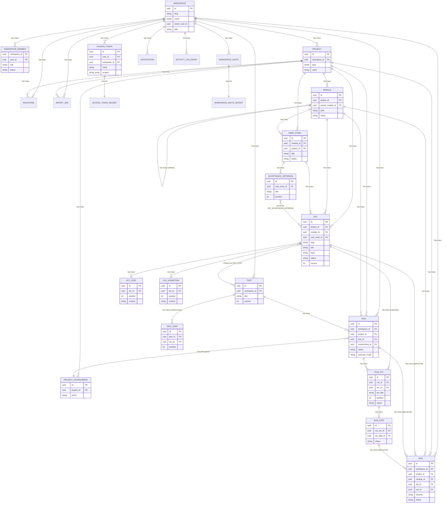
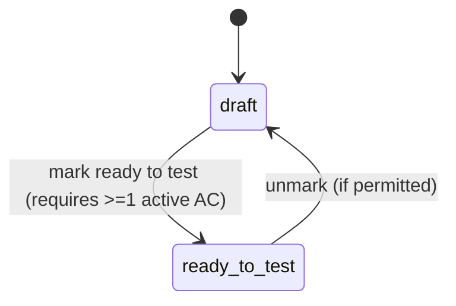
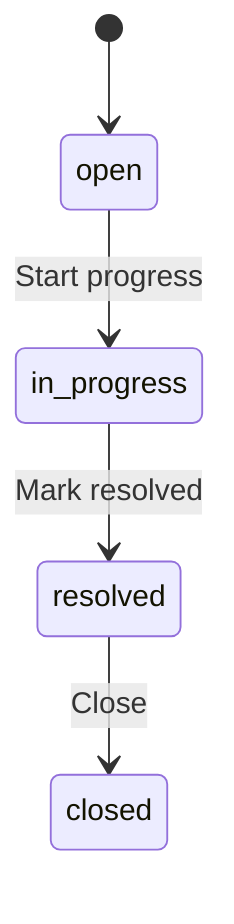
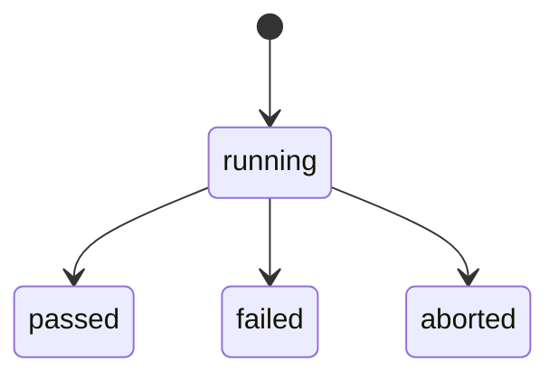
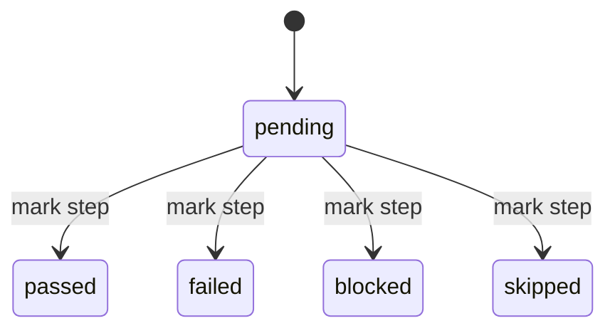
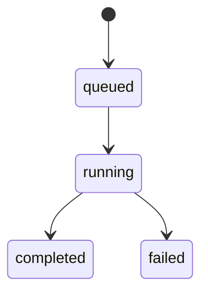
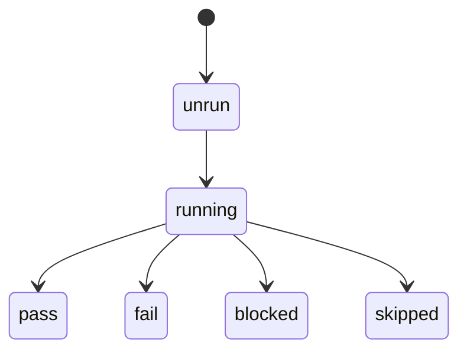

# Domain Glossary — Bunkai (upex-bunkai-tms)

> Discovery performed against `C:\Users\Genesis Ojose\Documents\Auto\Dojo 4\upex-bunkai-tms` (read-only). Primary source: `lib/types/supabase.ts` (generated Supabase types, header confirms `mcp__claude_ai_Supabase__generate_typescript_types` against project `fmbpikzpkafptqximhxn`) cross-referenced with `lib/types.ts` (hand-written domain types, still authoritative for enum unions since the generated file collapses Postgres `CHECK` constraints to bare `string`) and spot-checked migrations. Every entity, enum and rule below cites its file.
>
> **Important existing artifact found during discovery**: the target repo already maintains its own `upex-bunkai-tms/.context/business/domain-glossary.md`, a mature, code-synced (`origin/staging@4924f48`, 2026-08-12) terminology authority with an explicit anti-glossary and a change protocol. That file is **the authoritative source for product vocabulary** and is cited throughout this document as "target's own glossary." This document does not attempt to replace it — it restructures the same code-verified facts into the format this boilerplate's QA workflows expect (Core Entities / Enumerations / Business Rules / ERD / Terminology / State Flows / UI Labels), adds JSON examples and a Mermaid ERD, and defers to the target's own glossary on any wording dispute.

---

## 1. Core Entities

| Technical Name | Business Name | Description | Table/Collection | Key Attributes | Found In |
|---|---|---|---|---|---|
| `Workspace` | Workspace | Multi-tenant root. Owns Projects and membership; billing tier lives here. | `workspaces` | `id`, `slug`, `name`, `owner_user_id`, `plan` | `lib/types/supabase.ts:1351-1377`, `supabase/migrations/0001_tenancy.sql` |
| `WorkspaceMember` | Workspace Member | Join of a user to a Workspace with a role + membership status. | `workspace_members` | `workspace_id`, `user_id`, `role`, `status`, `joined_at` | `lib/types/supabase.ts:1319-1350`, `0001_tenancy.sql` |
| `WorkspaceInvite` | Workspace Invite | Pending invitation to join a Workspace at a given role. | `workspace_invites` (+ `workspace_invite_secrets` for the hashed token) | `id`, `email`, `role`, `expires_at`, `accepted_at`, `revoked_at` | `lib/types/supabase.ts:1249-1318`, `0010_workspace_invites.sql` |
| `Project` | Project | Container of Modules, Stories, ATCs, Tests, Runs, Bugs inside a Workspace. | `projects` | `id`, `workspace_id`, `slug`, `name`, `description` | `lib/types/supabase.ts:856-890`, `0002_projects_modules.sql` |
| `ProjectEnvironment` | Project Environment | Named deployment target a Run executes against, scoped to one Project. Seeded with Staging + Production. | `project_environments` | `id`, `project_id`, `name` | `lib/types/supabase.ts:827-855`, `0032_project_environments_crud.sql` |
| `Module` | Module | First-class tree node (depth ≤ 6) partitioning features; coverage/defect rollups aggregate by Module. | `modules` | `id`, `project_id`, `parent_module_id`, `path`, `name`, `position`, `archived_at` | `lib/types/supabase.ts:702-752`, `0002_projects_modules.sql`, `0014_module_soft_delete.sql`, `0015_module_move.sql` |
| `UserStory` | User Story (US) | Markdown-bodied requirement; carries the Ready-to-Test gate. Optional Jira `external_id`/`external_url`. | `user_stories` | `id`, `module_id`, `project_id`, `title`, `status`, `external_id`, `archived_at` | `lib/types/supabase.ts:1163-1216`, `lib/types.ts:56-67`, `0003_authoring.sql`, `0016_user_story_uniqueness.sql` |
| `AcceptanceCriterion` | Acceptance Criterion (AC) | Atomic, ordered, testable behavior of a User Story. | `acceptance_criteria` | `id`, `user_story_id`, `title`, `position`, `archived_at` | `lib/types/supabase.ts:22-59`, `0003_authoring.sql`, `0017_acceptance_criteria_ordering.sql` |
| `Atc` | ATC (Acceptance Test Case) | Reusable atomic unit of verification: precondition + action + assertions, mandatorily bound to ≥1 Acceptance Criterion. | `atcs` | `id`, `project_id`, `module_id`, `user_story_id`, `slug`, `title`, `layer`, `status`, `version`, `tags` | `lib/types/supabase.ts:265-337`, `lib/types.ts:107-121`, `0004_atcs.sql`, `0021_atc_create_update.sql` |
| `AtcStep` | ATC Step | One ordered step (content + optional input data + expected result) inside an ATC. | `atc_steps` | `id`, `atc_id`, `position`, `content`, `input_data`, `expected` | `lib/types/supabase.ts:230-264`, `0004_atcs.sql` |
| `AtcAssertion` | ATC Assertion | One ordered assertion attached to an ATC. | `atc_assertions` | `id`, `atc_id`, `position`, `content` | `lib/types/supabase.ts:201-229`, `0004_atcs.sql` |
| `AtcAcceptanceCriterion` | ATC↔AC Link | M:N join binding an ATC to the Acceptance Criteria it satisfies. Empty set is rejected (see Business Rules). | `atc_acceptance_criteria` | `atc_id`, `acceptance_criterion_id` | `lib/types/supabase.ts:171-200`, `0003_authoring.sql` |
| `Test` | Test | Named container owning an ordered chain of ATC references ("one-edit-many-tests"). | `tests` | `id`, `workspace_id`, `title`, `tags`, `version`, `created_by` | `lib/types/supabase.ts:1122-1162`, `0024_tests.sql` |
| `TestStep` (Chain step) | Chain Step | One position in a Test's ATC chain; `id` is the stable per-row reorder handle, distinct from `atc_id` (the same ATC may repeat at multiple positions). | `test_steps` | `id`, `test_id`, `atc_id`, `position` | `lib/types/supabase.ts:1086-1121`, `0024_tests.sql`, `0026_tests_reorder.sql` |
| `Run` | Run | One execution instance of a Test against a Project Environment (executor: human/agent/ci). | `runs` | `id`, `workspace_id`, `project_id`, `test_id`, `environment_id`, `status`, `executor_mode`, `started_at`, `finished_at`, `version` | `lib/types/supabase.ts:990-1085`, `0031_runs.sql`, `0036`–`0043` |
| `RunAtc` | Run ATC (Position) | Snapshot of one chain position within a Run — freezes the ATC title/status at run time so later ATC edits never corrupt history. | `run_atcs` | `id`, `run_id`, `atc_id`, `atc_title`, `position`, `status` | `lib/types/supabase.ts:891-932`, `0031_runs.sql` |
| `RunStep` | Run Step | Snapshot of one ATC step's execution outcome within a Run position. | `run_steps` | `id`, `run_atc_id`, `atc_step_id`, `content`, `status`, `note`, `evidence_url`, `executed_at` | `lib/types/supabase.ts:933-989`, `0031_runs.sql`, `0042_run_step_mark.sql` |
| `Bug` | Bug | Native defect record anchored to Module + ATC + Run, with Severity and a forward-only Status lifecycle. | `bugs` | `id`, `workspace_id`, `project_id`, `module_id`, `atc_id`, `run_id`, `run_step_id`, `severity`, `status`, `title`, `steps_to_reproduce`, `evidence_urls`, `assignee_user_id` | `lib/types/supabase.ts:338-440`, `0046_bugs.sql`, `0054_bug_assignment_status.sql` |
| `Milestone` | Milestone | Named goal with a target date inside a Project (post-MVP; Test Plan aggregation not yet wired). | `milestones` | `id`, `project_id`, `workspace_id`, `name`, `description`, `target_date`, `created_by` | `lib/types/supabase.ts:651-701`, `0064_milestones.sql` |
| `ImportJob` | Import Job | Asynchronous, one-way, polled import of Jira issues (by JQL) into a Project. | `import_jobs` | `id`, `workspace_id`, `project_id`, `jql`, `status`, `imported_count`, `created_count`, `updated_count`, `skipped_count`, `errors`, `next_page_token` | `lib/types/supabase.ts:532-597`, `lib/types.ts:79-102`, `0019_import_jobs.sql`, `lib/jira/import-runner.ts` |
| `AccessToken` | Personal Access Token (PAT) | Bearer credential for CLI/AI-agent access; scoped, revocable, acts as the issuing member and never exceeds that member's own permissions. | `access_tokens` (+ `access_token_secrets` for the hash) | `id`, `user_id`, `workspace_id`, `name`, `scopes`, `token_prefix`, `expires_at`, `revoked_at`, `last_used_at` | `lib/types/supabase.ts:60-129`, `0008_access_tokens.sql`, `0011_split_token_secrets.sql`, `lib/api/pat.ts` |
| `MagicLinkToken` | Magic-Link Token | Passwordless-login token, distinct credential family from PAT and invite tokens. | `magic_link_tokens` (+ `magic_link_token_secrets`) | `id`, `email`, `issued_at`, `expires_at`, `consumed_at` | `lib/types/supabase.ts:598-650` |
| `Notification` | Notification | Record of a workspace event delivered to a member's inbox; respects RLS entity visibility. | `notifications` | `id`, `workspace_id`, `recipient_user_id`, `event_type`, `entity_type`, `entity_id`, `payload`, `read_at` | `lib/types/supabase.ts:780-826`, `0053_notifications.sql` |
| `NotificationPreference` | Notification Preference | Per-user, per-event-type, per-channel delivery opt-in/out. | `notification_preferences` | `id`, `user_id`, `event_type`, `channel`, `enabled` | `lib/types/supabase.ts:753-779`, `0062_notification_preferences.sql` |
| `ActivityLogEntry` | Activity Event | Dotted `entity.verb` audit-log entry in the workspace Activity Stream (finer-grained than, and not reconciled with, Notification Event Type). | `activity_log` | `id`, `workspace_id`, `actor_user_id`, `action`, `entity_type`, `entity_id`, `payload` | `lib/types/supabase.ts:130-170`, `0045_activity_stream.sql` |
| `FeatureFlag` | Feature Flag | Global or workspace-scoped toggle. | `feature_flags` | `id`, `key`, `scope`, `enabled`, `workspace_id`, `payload` | `lib/types/supabase.ts:441-481`, `0009_cross_cutting.sql` |
| `IdempotencyKey` | Idempotency Key | Records a mutation's request hash + response snapshot to make retried writes safe. | `idempotency_keys` | `id`, `user_id`, `workspace_id`, `endpoint`, `key`, `request_hash`, `status`, `response_status`, `response_snapshot` | `lib/types/supabase.ts:482-531`, `0009_cross_cutting.sql`, `lib/api/idempotency.ts` |
| `UserViewState` | User View State | Per-user, per-project persisted UI state (e.g. mind-map layout) keyed by `view_kind`. | `user_view_state` | `user_id`, `project_id`, `view_kind`, `state` | `lib/types/supabase.ts:1217-1248` |

### Relationships

- Workspace **has many** Projects, WorkspaceMembers, WorkspaceInvites, AccessTokens, Notifications, ActivityLogEntries, Tests, Runs, Bugs, Milestones, ImportJobs.
- Project **belongs to** Workspace; **has many** Modules, ProjectEnvironments, UserStories, Atcs, Runs, Bugs, Milestones, ImportJobs.
- Module **belongs to** Project; **belongs to** (optional) parent Module (self-referential tree, depth ≤ 6); **has many** child Modules, UserStories, Atcs, Runs, Bugs.
- UserStory **belongs to** Module and (optionally) Project; **has many** AcceptanceCriteria, Atcs.
- AcceptanceCriterion **belongs to** UserStory; **has many** AtcAcceptanceCriterion links (M:N to Atc).
- Atc **belongs to** Project, Module, UserStory; **has many** AtcSteps, AtcAssertions, AtcAcceptanceCriterion links (M:N to AcceptanceCriterion), TestSteps (M:N to Test), RunAtcs.
- Test **belongs to** Workspace; **has many** TestSteps (ordered chain of Atc references, positions may repeat an `atc_id`); **has many** Runs.
- Run **belongs to** Workspace, Project, Test, ProjectEnvironment; **has many** RunAtcs; RunAtc **has many** RunSteps.
- Bug **belongs to** Workspace, Project, Module; **belongs to** (optional) Atc, Run, RunStep.
- AccessToken **belongs to** User; **belongs to** (optional) Workspace; **has one** AccessTokenSecret.
- ImportJob **belongs to** Workspace, Project.
- Milestone **belongs to** Workspace, Project.

### JSON examples (per entity, one row each — synthetic, shape only)

```json
// Workspace
{ "id": "6e2a...", "slug": "acme-qa", "name": "Acme QA", "owner_user_id": "u1...", "plan": "cloud", "created_at": "2026-01-10T00:00:00Z" }

// WorkspaceMember
{ "workspace_id": "6e2a...", "user_id": "u2...", "role": "member", "status": "active", "joined_at": "2026-01-11T00:00:00Z" }

// Project
{ "id": "p1...", "workspace_id": "6e2a...", "slug": "checkout", "name": "Checkout", "description": "Checkout flow" }

// Module
{ "id": "m1...", "project_id": "p1...", "parent_module_id": null, "path": "payments", "name": "Payments", "position": 0, "archived_at": null }

// UserStory
{ "id": "us1...", "module_id": "m1...", "project_id": "p1...", "title": "Refund a paid order", "status": "ready_to_test", "external_id": "BK-42", "archived_at": null }

// AcceptanceCriterion
{ "id": "ac1...", "user_story_id": "us1...", "title": "Refund is issued within 5 seconds", "position": 0, "archived_at": null }

// Atc
{ "id": "atc1...", "project_id": "p1...", "module_id": "m1...", "user_story_id": "us1...", "slug": "refund-happy-path", "title": "Refund succeeds with valid order id", "layer": "API", "status": "pass", "version": 3, "tags": ["smoke"], "archived_at": null }

// AtcStep
{ "id": "st1...", "atc_id": "atc1...", "position": 0, "content": "POST /orders/{id}/refund", "input_data": "{\"amount\":100}", "expected": "200 OK" }

// AtcAssertion
{ "id": "as1...", "atc_id": "atc1...", "position": 0, "content": "response.status === 'refunded'" }

// Test
{ "id": "t1...", "workspace_id": "6e2a...", "title": "Refund regression suite", "tags": ["regression"], "version": 2, "created_by": "u1..." }

// TestStep (chain step)
{ "id": "ts1...", "test_id": "t1...", "atc_id": "atc1...", "position": 0 }

// Run
{ "id": "r1...", "workspace_id": "6e2a...", "project_id": "p1...", "test_id": "t1...", "environment_id": "e1...", "status": "passed", "executor_mode": "ci", "started_at": "2026-08-01T00:00:00Z", "finished_at": "2026-08-01T00:05:00Z", "version": 1 }

// RunAtc
{ "id": "ra1...", "run_id": "r1...", "atc_id": "atc1...", "atc_title": "Refund succeeds with valid order id", "position": 0, "status": "passed" }

// RunStep
{ "id": "rs1...", "run_atc_id": "ra1...", "atc_step_id": "st1...", "content": "POST /orders/{id}/refund", "status": "passed", "note": null, "evidence_url": null, "executed_at": "2026-08-01T00:04:50Z" }

// Bug
{ "id": "b1...", "workspace_id": "6e2a...", "project_id": "p1...", "module_id": "m1...", "atc_id": "atc1...", "run_id": "r1...", "severity": "P2", "status": "open", "title": "Refund amount off by rounding", "steps_to_reproduce": "1. Refund $10.005 order", "evidence_urls": [] }

// AccessToken
{ "id": "tok1...", "user_id": "u1...", "workspace_id": "6e2a...", "name": "ci-deploy", "scopes": ["atc:read", "run:execute"], "token_prefix": "bk_live_ab12", "expires_at": null, "revoked_at": null }

// ImportJob
{ "id": "ij1...", "workspace_id": "6e2a...", "project_id": "p1...", "jql": "project = BK AND status = Done", "status": "running", "imported_count": 12, "created_count": 10, "updated_count": 2, "skipped_count": 0, "errors": [] }
```

*Found in*: `lib/types/supabase.ts`, `lib/types.ts` (field shapes); JSON values are illustrative, not extracted from live data (read-only discovery, no DB query performed).

---

## 2. Enumerations and Constants

### `workspaces.plan` — `WorkspacePlan`

| Value | Business Meaning | Usage Context |
|---|---|---|
| `community` | Free self-serve tier — 5 seats, 3 projects, 30-day retention | Workspace creation default; billing overview |
| `cloud` | Paid tier — 25 seats, 50 projects, 90-day retention, $24/seat/month | Billing overview, seat/project meters |
| `enterprise` | Unlimited seats/projects/retention, custom pricing | Billing overview |

*Found in*: `lib/types.ts:12`, `supabase/migrations/0001_tenancy.sql:33`, `lib/billing/plan-tiers.ts:38-69` (`PLAN_TIERS`).

### `workspace_members.role` / `workspace_invites.role` — `MemberRole`

| Value | Business Meaning | Usage Context |
|---|---|---|
| `viewer` | Read-only member | RBAC gate on mutating endpoints |
| `member` | Standard write access | Default authoring role |
| `admin` | Can manage members, issue `workspace:admin` PATs | Membership + token management |
| `owner` | Workspace owner (one per workspace, `workspaces.owner_user_id`) | Full control, only role that can leave-with-transfer semantics |

Note: `workspace_invites.role` CHECK constraint (`0010_workspace_invites.sql:18`) allows only `viewer`/`member`/`admin` — `owner` cannot be granted via invite.

*Found in*: `lib/types.ts:13`, `supabase/migrations/0001_tenancy.sql:44`, `0010_workspace_invites.sql:18`, `lib/workspaces/invites.ts:5`.

### `workspace_members.status` — `MemberStatus`

| Value | Business Meaning | Usage Context |
|---|---|---|
| `active` | Currently a member | Default query filter for "who can access this workspace" |
| `invited` | Invite sent, not yet accepted | Pending-member UI state |
| `suspended` | Access revoked without full removal | Membership admin actions |

*Found in*: `lib/types.ts:14`, `supabase/migrations/0001_tenancy.sql:46`.

### `atcs.layer` — `AtcLayer`

| Value | Business Meaning | Usage Context |
|---|---|---|
| `UI` | Browser-driven ATC | ATC authoring layer selector |
| `API` | HTTP-driven ATC | ATC authoring layer selector |
| `Unit` | Code-level ATC | ATC authoring layer selector |

*Found in*: `lib/types.ts:104`, `supabase/migrations/0004_atcs.sql:60`.

### `atcs.status` — `AtcStatus` (Execution Status)

| Value | Business Meaning | Usage Context |
|---|---|---|
| `pass` | Last run passed | `status_dot`, ATC tree/list rows |
| `fail` | Last run failed | `status_dot` |
| `blocked` | Execution blocked | `status_dot` |
| `skipped` | Execution skipped | `status_dot` |
| `running` | Currently executing | `status_dot`, live/realtime state |
| `unrun` | Never executed | `status_dot`; rendered "Unrun" in UI even though `run_atcs.status` stores `pending` for the same concept at the run-position grain (see §6, Run-status grain split) |

*Found in*: `lib/types.ts:105`, `supabase/migrations/0004_atcs.sql:63`; target's own glossary §3 "status_dot" + "Run-status grain split" rows.

### `runs.status` — `RunStatus` (Run grain — whole execution)

| Value | Business Meaning | Usage Context |
|---|---|---|
| `running` | Run in progress | Run header, realtime channel |
| `passed` | All positions passed | Terminal state |
| `failed` | At least one position failed | Terminal state |
| `aborted` | Run terminated abnormally (run-grain-only terminal outcome; never appears at position grain) | Terminal state, `abort_reason` populated |

*Found in*: `lib/types/supabase.ts:990-1085` (Row shape), `supabase/migrations/0031_runs.sql:80`, `lib/runs/mark-step-view.ts:16`.

### `runs.executor_mode`

| Value | Business Meaning | Usage Context |
|---|---|---|
| `human` | A person executed the run manually | Rendered "Human" (Run History, project Run report) or "Manual" (Home active-runs panel) — known UI drift, see §7 |
| `agent` | An AI agent executed the run via a PAT | API-first/agent-operable value proposition |
| `ci` | A CI pipeline executed the run | CI-ingested automated runs |

*Found in*: `supabase/migrations/0031_runs.sql:81`.

### `run_atcs.status` / `run_steps.status` — `StepStatus` (Position grain — one chain step within a run)

| Value | Business Meaning | Usage Context |
|---|---|---|
| `pending` | Not yet executed at this position (rendered "Unrun" in UI) | Default on run creation |
| `passed` | Step/position passed | Mark-step action outcome |
| `failed` | Step/position failed | Mark-step action outcome |
| `blocked` | Step/position blocked | Mark-step action outcome |
| `skipped` | Step/position skipped | Mark-step action outcome (never `aborted` — that value is run-grain only) |

*Found in*: `supabase/migrations/0031_runs.sql:127,174`, `lib/runs/mark-step-view.ts:17-18`.

### `bugs.severity`

| Value | Business Meaning | Usage Context |
|---|---|---|
| `P1` | Critical (rendered word in UI) | Bug creation form, severity filter |
| `P2` | Major | Bug creation form, severity filter |
| `P3` | Minor | Bug creation form, severity filter |
| `P4` | Trivial | Bug creation form, severity filter |

Storage literal (`P1`–`P4`) is canonical for API/schema/Jira-field talk; the word (Critical/Major/Minor/Trivial) is canonical for UI copy and prose — both forms are correct in their own layer (target's own glossary §3, "Bug Severity" row).

*Found in*: `supabase/migrations/0046_bugs.sql:106`, `lib/bugs/errors.ts:111` ("Severity must be one of P1, P2, P3, or P4").

### `bugs.status` (forward-only lifecycle)

| Value | Business Meaning | Usage Context |
|---|---|---|
| `open` | Newly filed | Initial state |
| `in_progress` | Being worked | "Start progress" action |
| `resolved` | Fix applied, pending close | "Mark resolved" action |
| `closed` | Terminal | "Close" action |

One stage forward at a time, never backward — enforced procedurally by `bunkai_transition_bug_status` (SQLSTATE `45310`/`45311`), not by a CHECK constraint.

*Found in*: `supabase/migrations/0046_bugs.sql:108`, `0054_bug_assignment_status.sql`, `lib/bugs/errors.ts:41-72`, `lib/bugs/constants.ts` (`BUG_STATUS_VALUES`).

### `user_stories.status` — `UserStoryStatus` (Ready-to-Test gate)

| Value | Business Meaning | Usage Context |
|---|---|---|
| `draft` | ACs may still be incomplete | Default on creation |
| `ready_to_test` | Explicit signal ACs are settled enough to author ATCs against; requires ≥1 active AC (SQLSTATE `45010` otherwise) | "Mark ready to test" action |

Exactly two states, no intermediate — a gate, not a workflow (target's own glossary §3).

*Found in*: `lib/types.ts:54`, `supabase/migrations/0017_acceptance_criteria_ordering.sql:27`, `0018_ready_to_test_gate_fn.sql:47-52`.

### `import_jobs.status` — `ImportJobStatus`

| Value | Business Meaning | Usage Context |
|---|---|---|
| `queued` | Job created, not yet started | Import dialog initial state |
| `running` | Actively importing (polled) | Import job progress UI |
| `completed` | Finished (may still carry per-issue `errors[]`) | Import job final state |
| `failed` | Job-level failure | Import job final state |

*Found in*: `lib/types.ts:79`, `supabase/migrations/0019_import_jobs.sql:15`.

### `idempotency_keys.status`

| Value | Business Meaning | Usage Context |
|---|---|---|
| `pending` | Mutation in flight | Idempotency-key lookup during a retried request |
| `succeeded` | Mutation completed, response cached | Idempotent replay returns cached response |
| `failed` | Mutation errored | Idempotency-key lookup |

*Found in*: `supabase/migrations/0009_cross_cutting.sql:36`.

### `feature_flags.scope`

| Value | Business Meaning | Usage Context |
|---|---|---|
| `global` | Applies to all workspaces | Platform-wide toggles |
| `workspace` | Applies to one workspace | Per-tenant toggles |

*Found in*: `supabase/migrations/0009_cross_cutting.sql:120`.

### `notification_preferences.event_type` / `channel`

| Value | Business Meaning | Usage Context |
|---|---|---|
| `run_lifecycle` | Run started/finished/aborted events | Notification preference toggle |
| `bug_lifecycle` | Bug created/assigned/status-changed events | Notification preference toggle |
| `mentions` | @-mention events | Notification preference toggle |
| `in_app` (channel) | In-app inbox delivery | Channel toggle |
| `email` (channel) | Email digest delivery | Channel toggle |

*Found in*: `supabase/migrations/0062_notification_preferences.sql:45-46`.

### PAT scopes (`access_tokens.scopes`, closed set)

| Value | Business Meaning | Usage Context |
|---|---|---|
| `atc:read` | Read ATCs | Default headless-auth scope |
| `atc:write` | Create/modify ATCs | Default headless-auth scope |
| `run:execute` | Create/mark runs | Default headless-auth scope |
| `workspace:admin` | Admin-level workspace operations | Excluded from headless-auth defaults; requires explicit issuance by an admin/owner with `workspace_id`, never via headless auth |

*Found in*: `lib/api/pat.ts:17-84` (`ALLOWED_PAT_SCOPES`, `DEFAULT_PAT_SCOPES`), target's own glossary §3 "Personal Access Token (PAT)".

### Non-DB code constants (view-state / derived enums, not stored)

| Constant | Values | Found In |
|---|---|---|
| `MeterState` | `normal` \| `warning` \| `limit-reached` | `lib/billing/plan-tiers.ts:71` |
| `HeatBucket` | `clean` \| `low` \| `elevated` \| `hotspot` | `lib/metrics/defect-heatmap.ts:11` |
| `TrendDirection` | `rising` \| `falling` \| `flat` | `lib/metrics/defect-heatmap.ts:12` |
| `CoverageSegment` | `all` \| `gaps` \| `notrun` | `lib/coverage/coverage-view.ts:16` |
| `TraceabilityRunState` | `in_flight` \| `aborted` \| `passed` \| `failed` \| `blocked` \| `skipped` | `lib/traceability/chain-view.ts:22` (the derived, third grain of the Run-status split) |
| Reserved suite tags | `smoke`, `sanity`, `regression` (closed, case-normalized subset of `tests.tags`) | target's own glossary §3 "Reserved suite tag" — not found as a standalone TS union in this pass; free-text array column with app-level normalization |

*Found in*: files cited per row.

---

## 3. Business Rules

### Rule: RLS is the sole tenant-isolation boundary (no app-layer role check backstop on several routes)

- **Description**: Every table's cross-tenant access is enforced by Postgres Row-Level Security policies keyed to `workspace_members.role`, not by application code. An anon Supabase client (no user JWT) must see zero rows; an authenticated user must see only workspaces they belong to.
- **Entities Affected**: `Workspace` and, by extension, every child table (Project, Module, Atc, Test, Run, Bug, …) whose RLS policy chains back to workspace membership.
- **Validation**: `lib/api/rls-parity.test.ts` mints a real user JWT (`mintUserJwt`, same path `resolveIdentity()` uses), attaches it to an anon-key Supabase client, and asserts the returned row set matches exactly the caller's own workspace memberships — no more, no less.
- **Error Message**: N/A at the RLS layer (rows are simply absent, not a 403) — the API layer separately raises `forbidden` (`You must be a member of this workspace with write access.`) on SQLSTATE `42501` for RPC-mediated writes.
- **Found In**: `lib/api/rls-parity.test.ts`, `supabase/migrations/0001_tenancy.sql:60-211`, `0005_rls_helpers.sql`.
- **Given/When/Then**:
  - **Given** User A is a member of Workspace 1 only, and Workspace 2 exists owned by User B
  - **When** User A's impersonating client queries `workspaces`
  - **Then** the result set contains Workspace 1 and does not contain Workspace 2, even though both rows exist in the database

### Rule: A Bug's status can only advance one lifecycle stage at a time, never backward

- **Description**: `open → in_progress → resolved → closed` is a strict, one-step-forward sequence enforced procedurally by the `bunkai_transition_bug_status` RPC — not by a CHECK constraint, so a reviewer (not the database) must hold the invariant on any new write path.
- **Entities Affected**: `Bug`.
- **Validation**: RPC raises SQLSTATE `45310` (skipped a stage, e.g. `open → resolved`) or `45311` (backward or same-status move).
- **Error Message**: `"A bug must move to '<nextStage>' first."` (45310) / `"A bug's status cannot move backward."` (45311)
- **Found In**: `lib/bugs/errors.ts:41-72`, `supabase/migrations/0054_bug_assignment_status.sql`.
- **Given/When/Then**:
  - **Given** a Bug currently `open`
  - **When** a caller requests a transition directly to `resolved`
  - **Then** the API returns `validation_failed` with message "A bug must move to 'in_progress' first."

### Rule: An ATC cannot exist without at least one bound Acceptance Criterion (no orphan ATCs)

- **Description**: `bunkai_create_atc` / `bunkai_update_atc` require `p_ac_ids` to be a non-empty array, and every id in it must belong to the ATC's own User Story — enforced before the ATC row (or its AC links) is written.
- **Entities Affected**: `Atc`, `AcceptanceCriterion`, `AtcAcceptanceCriterion`.
- **Validation**: RPC checks `coalesce(array_length(p_ac_ids, 1), 0) = 0` and a distinct-membership check against the User Story's own ACs; raises SQLSTATE `45020` on either failure.
- **Error Message**: `"Every acceptance criterion must belong to the given user story."`
- **Found In**: `supabase/migrations/0021_atc_create_update.sql:158-168,295-305`, `lib/atcs/errors.ts:16-19`.
- **Given/When/Then**:
  - **Given** a User Story with Acceptance Criteria AC-1 and AC-2 only
  - **When** an ATC is created with `p_ac_ids: []` (empty) or `p_ac_ids: [AC-3]` (belongs to a different story)
  - **Then** the create is rejected with `ac_outside_user_story` and no ATC row is written — "un ATC sin historia de usuario no puede existir" (target's own About page pitch, corroborated at the schema-write level)

### Rule: A User Story cannot be marked `ready_to_test` with zero active Acceptance Criteria

- **Description**: The two-state Ready-to-Test gate requires at least one non-archived AC to exist before the transition to `ready_to_test` is allowed, preventing a story from being flagged testable with nothing to test against.
- **Entities Affected**: `UserStory`, `AcceptanceCriterion`.
- **Validation**: `bunkai_set_user_story_status` raises SQLSTATE `45010` when `p_status = 'ready_to_test'` and the active-AC count is zero.
- **Error Message**: exception code `ac_required_for_ready_to_test` (no bespoke client-facing string found in this pass; mapped generically through the RPC error envelope).
- **Found In**: `supabase/migrations/0018_ready_to_test_gate_fn.sql:47-52`.
- **Given/When/Then**:
  - **Given** a User Story in `draft` status with all its ACs archived (zero active)
  - **When** a caller requests `status = ready_to_test`
  - **Then** the RPC raises `ac_required_for_ready_to_test` and the story stays `draft`

### Rule: Billing meter crosses to `warning` at ≥80% usage and `limit-reached` at ≥100%; unlimited resources never warn

- **Description**: Seat/project usage against a plan tier's limit is classified into three states. A `null` limit (Enterprise) is always `normal`. The 80% boundary is inclusive of `warning`.
- **Entities Affected**: `Workspace` (via `plan` and its associated seat/project counts).
- **Validation**: `meterState(used, limit)` — pure function, unit-tested per its own AC references (AC2/AC15/AC4/AC5/AC6 in the source comment).
- **Error Message**: N/A — this is a display-state classifier, not a blocking validation (billing has no payment enforcement yet, per `.context/business/business-model.md` §5 of this boilerplate's own discovery).
- **Found In**: `lib/billing/plan-tiers.ts:71-91`.
- **Given/When/Then**:
  - **Given** a Cloud workspace with `seatLimit: 25`
  - **When** 20 seats are used (`20/25 = 0.8`)
  - **Then** `meterState` returns `warning` (the 80% boundary is inclusive, not exclusive)

### Additional rules (documented, not expanded to Given/When/Then — see file citation for full detail)

| Rule | Entities | Found In |
|---|---|---|
| A PAT's `workspace:admin` scope cannot be issued via headless auth; requires an explicit `workspace_id` and an admin/owner-role caller | `AccessToken` | `lib/api/pat.ts:29-84` |
| An ATC's tag set is capped at 10 tags, enforced both client-side (`Zod` `.max(MAX_ATC_TAGS)`) and RPC-side as a backstop (SQLSTATE `45024`) | `Atc` | `supabase/migrations/0065_atc_tags_cap_guard.sql`, `lib/atcs/errors.ts:43-50` |
| A Test's chain reorder addresses rows by the surrogate `step_id`, never by `atc_id` (the same ATC may occupy multiple chain positions) | `Test`, `TestStep` | target's own glossary §3 "Chain step", §4 anti-glossary row |
| Removing a Project Environment is blocked while any Run references it, preserving run history | `ProjectEnvironment`, `Run` | target's own glossary §3 "Project Environment" |
| A Bug assignee must be an active workspace member with a non-`viewer` role | `Bug`, `WorkspaceMember` | `lib/bugs/errors.ts:73-83` (SQLSTATE `45312`/`45313`) |
| A 404 for "bug not found" and "bug exists but caller isn't a workspace member" deliberately collapse into the same non-disclosing response | `Bug` | `lib/bugs/errors.ts:29-40,123-134` |
| Story title must be 3–200 characters; AC title has its own min/max (mirrored client/RPC) | `UserStory`, `AcceptanceCriterion` | `lib/user-stories/errors.ts:22-33`, `lib/acceptance-criteria/errors.ts` |
| Bug evidence links capped at 10 | `Bug` | `lib/bugs/errors.ts:114-117` (SQLSTATE `45303`) |

---

## 4. Entity Relationships Diagram



**Syntax check**: `erDiagram` keyword present, every relationship line uses a balanced `||--o{`/`}o--o{`/`}o--||` cardinality token followed by a quoted label, every entity block opens with `{` and closes with `}` (counted: 15 entity blocks, 15 open/close pairs), no unclosed quotes. Rendered mentally against Mermaid's `erDiagram` grammar — valid.

---

## 5. Terminology Mapping

### Technical → Business (KATA code vocabulary → Bunkai product vocabulary)

Sourced verbatim from the product's own public "Origin" mapping table (`app/about/_components/sections.tsx`, `Origin()`, lines 196-203 — the product explicitly renders this table to visitors):

| KATA (the code) | Bunkai (the product) |
|---|---|
| Method `@atc('BK-166')` | ATC entity, UI layer |
| Domain component file | Module in the tree |
| Chain in `tests/e2e/` | Test — ordered chain of ATCs |
| Steps layer (3.5) | ATCs reused as precondition |
| Playwright execution | Run with `ci` or `agent` executor |
| Reporter output | Results, coverage and heatmap |

Additional field/table → business-term mapping (this discovery pass):

| Technical (schema/API) | Business term |
|---|---|
| `atcs.layer` | ATC layer (UI / API / Unit) |
| `atcs.status` / `status_dot` | Execution Status |
| `user_stories.status` | Ready-to-Test gate |
| `test_steps.id` | Chain step handle (`step_id`) — reorder key, distinct from `atc_id` |
| `runs.executor_mode` | Executor (Human/Manual, Agent, CI) |
| `bugs.severity` (`P1`-`P4`) | Critical / Major / Minor / Trivial |
| `access_tokens` | Personal Access Token (PAT) |
| `import_jobs` | Import Job (Jira JQL import) |
| `workspaces.plan` | Billing Plan (Tier) |
| `meterState` | Seat/project usage meter (normal/warning/limit-reached) |

### Abbreviations and Acronyms

| Acronym | Expansion | Definition |
|---|---|---|
| **ATC** | Acceptance Test Case | Reusable atomic unit of verification bound to ≥1 AC. **Not** "Atomic Test Component" — that expansion is explicitly banned (see target's own glossary §0/§4). |
| **KATA** | Component Action Test Architecture | Layered test-automation architecture this boilerplate's own framework uses; Bunkai is its productization. |
| **IQL** | Integrated Quality Lifecycle | The QA methodology KATA automates. |
| **US** | User Story | The requirement under test. |
| **AC** | Acceptance Criterion | Atomic testable condition of a US. |
| **ATP** | Acceptance Test Plan | Stage-1 QA artifact (methodology sense — not the product's "Test Plan" entity, see anti-glossary). |
| **ATR** | Acceptance Test Results | Stage-3 QA artifact. |
| **TC** | Test Case | Generic QA term; in Bunkai realized as `Test` (ordered ATC chain). |
| **TMS** | Test Management System | The product category. |
| **PAT** | Personal Access Token | Bearer credential, `access_tokens` table. |
| **RLS** | Row-Level Security | Postgres access-control mechanism; the sole tenant-isolation boundary in this product. |
| **RBAC** | Role-Based Access Control | The four-role (`viewer`/`member`/`admin`/`owner`) permission model. |
| **PBI** | Product Backlog Item | This boilerplate's own local-context term, not a Bunkai product term. |
| **JQL** | Jira Query Language | Query string used to select issues for Import Job. |
| **EP / BVA** | Equivalence Partitioning / Boundary Value Analysis | Two of five controlled test-design techniques. |
| **CI** | Continuous Integration | One of the three `runs.executor_mode` values. |

*Found in*: `app/about/_components/sections.tsx:188-203`; target's own glossary §1.

---

## 6. Status/State Flows

### UserStory (`user_stories.status`) — Ready-to-Test gate



*Found in*: `lib/types.ts:54`, `supabase/migrations/0018_ready_to_test_gate_fn.sql`.

### Bug (`bugs.status`) — forward-only lifecycle



Note: backward transitions and stage-skipping are explicitly rejected (SQLSTATE `45310`/`45311`) — no reverse arrows exist in the real system.

*Found in*: `supabase/migrations/0046_bugs.sql`, `0054_bug_assignment_status.sql`, `lib/bugs/errors.ts:41-72`.

### Run (`runs.status`) — run grain



*Found in*: `supabase/migrations/0031_runs.sql:80`, `0036_run_abort.sql`, `0037_run_finish.sql`.

### RunAtc / RunStep (`run_atcs.status` / `run_steps.status`) — position grain



Note: `aborted` never appears here — it is a run-grain-only terminal outcome (target's own glossary §3, "Run-status grain split").

*Found in*: `supabase/migrations/0031_runs.sql:127,174`, `0042_run_step_mark.sql`.

### ImportJob (`import_jobs.status`)



*Found in*: `lib/types.ts:79`, `supabase/migrations/0019_import_jobs.sql:15`.

### AtcStatus / Traceability derived chip (execution-status display, not a strict lifecycle — included for completeness)



This is a **display classification**, not an enforced transition graph — `atcs.status` is written from the most recent run's outcome, not walked through a state machine of its own.

*Found in*: `lib/types.ts:105`, `supabase/migrations/0004_atcs.sql:63`.

**Count of stateDiagram-v2 blocks in this section: 6.**

---

## 7. UI Labels Reference

No i18n bundle exists in the target repo — `find . -iname locales -o -iname messages` (excluding `node_modules`) returned nothing, and no translation JSON files were found. This confirms the codebase's earlier discovery note: an English-only MVP. Labels below were extracted directly from component source (form field labels, placeholders, button/action text), not from a translation catalog.

### `user-story-form.tsx` (`app/(app)/projects/[projectSlug]/user-story-form.tsx`)

| Field | Label | Placeholder / Hint |
|---|---|---|
| Title | "Title" | `"Refund a paid order"`; hint on error: "Title must be at least 3 characters." |
| Description | "Description" | "Markdown, optional"; placeholder "Describe the story in Markdown." |
| Jira key | "Jira key" | "optional, e.g. BK-42"; placeholder `"BK-42"`; locked hint: "The Jira link is set and cannot be changed." |
| Form header | "New user story" / "Edit user story" (conditional on edit mode) | — |

*Found in*: `app/(app)/projects/[projectSlug]/user-story-form.tsx:130-188`.

### `create-module-form.tsx` (`app/(app)/projects/[projectSlug]/create-module-form.tsx`)

| Field | Label | Placeholder / Hint |
|---|---|---|
| Name | "Module name" | `"Checkout flow"` (sibling `create-project-form.tsx`) |
| Description | "Description" | "optional"; max 500 chars (`MAX_DESCRIPTION_LENGTH`) |

*Found in*: `app/(app)/projects/[projectSlug]/create-module-form.tsx:163-194`.

### `create-project-form.tsx` (`app/(app)/projects/create-project-form.tsx`)

| Field | Placeholder |
|---|---|
| Name | `"Checkout flow"` |
| Description | `"What this project covers."` |

*Found in*: `app/(app)/projects/create-project-form.tsx:154,180`.

### Bug/Severity vocabulary rendered in UI (not a form scan — cross-referenced from target's own glossary §3)

| Stored value | Rendered word |
|---|---|
| `P1` | Critical |
| `P2` | Major |
| `P3` | Minor |
| `P4` | Trivial |

### Known UI copy that differs across screens for the same underlying value (recorded, not "fixed" — see target's own glossary §5)

| Concept | Renders as | Where |
|---|---|---|
| `runs.executor_mode = 'human'` | "Human" vs "Manual" | Run History/project report vs Home active-runs panel |
| Terminal run/step verdicts | "Passed"/"Failed" vs "Pass"/"Fail" | Runner/activity copy vs traceability chip/mark buttons |
| `run_atcs.status = 'pending'` | "Unrun" | Verdict badge |
| AC bound but never executed | "awaiting execution" vs "Never run" | Home coverage summary vs project Coverage screen |

---

## 8. Discovery Gaps

- **Reserved suite tags** (`smoke`/`sanity`/`regression`): confirmed by the target's own glossary as a closed, case-normalized subset of the free-text `tests.tags` array, but no standalone TypeScript enum/constant was located in this pass to cite as a code artifact (likely inline validation logic in a tests-domain file not opened during this discovery). Documented from the target's own glossary only — recommend a follow-up code read of `lib/tests/` before treating the exact reserved-value list as code-verified rather than glossary-verified.
- **`ATC Priority`** (Critical/High/Medium/Low): per the target's own glossary, this is *not yet shipped* (tracked as BK-399) — it does not exist as a column on `atcs` in the generated Supabase types read in this pass. Listed here as a Discovery Gap rather than a live enumeration so it is not mistaken for shipped schema.
- **Test-design technique** field (EP/BVA/State-Transition/Decision-Table/Pairwise) on `atcs`: same status — not yet shipped (BK-399), not present in `lib/types/supabase.ts`.
- **Post-MVP entities** (Test Plan, Channel, Message, Mention, Rich Link, Subscription, Invoice, CI Results File): named and defined in the target's own glossary §3 as post-MVP (epics BK-201/208/210/221/224) but **no corresponding tables exist** in the generated `lib/types/supabase.ts` read in this pass — confirmed absent from the live schema, not merely unread. Do not treat these as testable entities yet.
- **`Test Plan` progress/membership mechanics**: referenced in the target's own glossary as a planned entity; cannot be verified against code since no `test_plans` table exists yet.
- **Live enum drift risk**: `lib/types/supabase.ts` collapses every Postgres `text` + `CHECK` column to bare `string` (its own `Enums: { [_ in never]: never }` — the Supabase generator does not surface `CHECK`-constraint value sets as TS unions here). All enum tables in §2 were therefore reconstructed from `lib/types.ts` (hand-maintained, may drift from the live migration if not updated) and cross-checked against migration `CHECK` clauses directly — the migration `CHECK` clause is treated as ground truth, `lib/types.ts` as a corroborating source, per this task's own instructions.
- **`workspace_invites.role` excludes `owner`** while `workspace_members.role` includes it — confirmed intentional (an invite cannot grant ownership) but no explicit business-rule comment was found stating this is deliberate rather than an oversight; inferred from the differing CHECK constraints alone.

---

## 9. QA Usage Guide

How to use this file when authoring test cases against Bunkai:

1. **Start from §1 (Core Entities) and §4 (ERD)** to understand which table a feature touches and its cardinality to neighbors — most cross-entity bugs in this product are traceability-chain bugs (AC → ATC → Test → Run → Bug), so knowing the chain matters more here than in a typical CRUD app.
2. **Before writing any test around a status/state field, check §6 (Status/State Flows)** — several fields that look like simple enums are actually forward-only or gated (User Story Ready-to-Test gate, Bug status lifecycle). A negative test for "can this go backward / skip a stage" is mandatory coverage for those fields, not optional, per §3's Business Rules.
3. **Every mutating test needs the RLS/tenant-isolation negative case** (§3, Rule 1) — "another workspace cannot see or write this row" — mirroring the `*-isolation.test.ts` pattern already used throughout `lib/` in the target repo. This is not extra coverage; per this boilerplate's own `business-model.md` QA Relevance table, a missed RLS policy is a direct cross-tenant data leak.
4. **Use §2 (Enumerations) enum values verbatim** in test data and assertions — the storage literal (e.g. `P2`, not "Major") for API/DB-level assertions; the rendered word for UI-level assertions. Do not invent values outside the documented set.
5. **Check §8 (Discovery Gaps) before testing anything from the post-MVP entity list** (Test Plan, ATC Priority, Test-design technique field, Channel/Message chat) — these are not yet shipped; testing them as if live wastes effort, matching the boilerplate's own note about the product's `Capabilities.tsx` shipped-vs-`próximo` matrix.
6. **For terminology disputes, defer to the target repo's own `.context/business/domain-glossary.md`** (cited throughout this file) over this document — it is the product's live, code-synced, change-controlled source of truth, complete with an anti-glossary (its §4) listing terms that must never appear in specs, ACs, or Jira content (e.g. never "Atomic Test Component", never bare "plan", never "Free/Team/Enterprise" tiers).
7. **Business rules with a Given/When/Then in §3** are ready to drop directly into an ATP as the seed scenario for that rule's positive/negative pair — each already cites its enforcing SQLSTATE, which doubles as the expected error-code assertion for the negative case.
