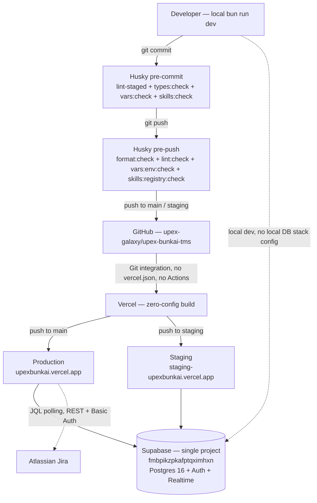
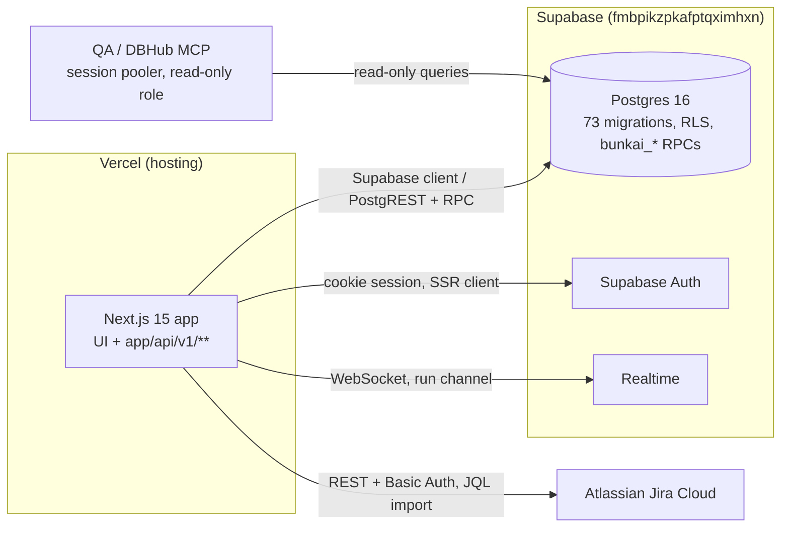

# Infrastructure — Bunkai (upex-bunkai-tms)

> Discovery performed against `C:\Users\Genesis Ojose\Documents\Auto\Dojo 4\upex-bunkai-tms` (read-only). Cross-references `.context/project-config.md` and `.context/SRS/architecture.md`. See `backend.md` / `frontend.md` for the two halves of the single Next.js codebase this infra hosts.

---

## Overview Diagram

**No CI/CD stage exists between "push" and "Vercel build."** There is no automated test-run, lint-run, or approval gate in this diagram between `GitHub` and `Vercel` — Husky hooks are the only automated gate, and they run client-side, before the push even leaves the developer's machine (bypassable with `--no-verify`, though this repo's own doctrine forbids that).

---

## CI/CD Configuration

**Platform: None.** Confirmed absent — no `.github/workflows/` directory exists in the target repo. No GitLab CI, Azure Pipelines, CircleCI, or Jenkins config found either (no `.gitlab-ci.yml`, `azure-pipelines.yml`, `.circleci/`, `Jenkinsfile`).

This is a **stated fact from prior discovery** (`.context/project-config.md` §Infrastructure, `.context/SRS/architecture.md` §12 QA Relevance), re-confirmed here by direct glob against the target repo — not re-derived by searching further, per this task's briefing.

The only automated gates that exist are git-hook-based (Husky), and they run **locally, per-developer, pre-push** — not server-side, not on a shared runner, and not blocking for anyone who has hooks disabled or bypasses them:

| Hook | Commands | Scope |
|---|---|---|
| `pre-commit` (`.husky/pre-commit`) | `bunx lint-staged` + `bun run types:check` + `bun run vars:check` + `bun run skills:check` (+ conditional `skills:registry:check` if skill files are staged) | Fast, full-repo type/vars/skills checks; lint-staged only touches staged files |
| `pre-push` (`.husky/pre-push`) | `bun run format:check && bun run lint:check && VARS_ENV_CHECK_DRIFT=warn bun run vars:env:check && bun run skills:registry:check` | Full-repo format/lint + env-drift check (warn-only) + unconditional skill-registry freshness |

**`bun test` is invoked by neither hook, nor by `repo:check`/`repo:fix`, nor by anything else in the repo.** Nothing runs the 145+ co-located `.test.ts` files automatically, anywhere, ever, in this repo's current state.

---

## Deployment Configuration

| Aspect | Value | Evidence |
|---|---|---|
| Hosting platform | Vercel | `.context/project-config.md` |
| Config file | **None** — no `vercel.json`, no `now.json` | Confirmed absent by glob against target repo root |
| Deploy mechanism | Vercel's native Git integration — zero-config Next.js detection and build | Absence of `vercel.json` is itself the signal (Vercel auto-detects Next.js and needs no config for a standard app) |
| Inferred trigger mapping | Push to `main` → Production deploy; push to `staging` → Staging alias deploy | Consistent with the target repo's own `git_strategy: main-integration` (per `.context/SRS/architecture.md` and this boilerplate's own `.agents/project.yaml` git-strategy doctrine) — **not independently verified against a live Vercel project dashboard in this read-only pass; inferred from branch-naming + URL-naming convention only** |
| Preview deployments | Not verified — Vercel's default behavior is a preview deploy per PR/branch push, but no PR history or Vercel dashboard access was available in this pass | Discovery Gap |
| Docker/Compose | None found — no `Dockerfile`, no `docker-compose.yml` | Confirmed absent by glob |

---

## Environments Matrix

Reused directly from `.context/project-config.md` — not re-derived.

| Environment | URL | Branch | Auto Deploy | Database |
|---|---|---|---|---|
| Local | `http://localhost:3000` | — | — (`next dev`, direct) | Same shared Supabase project (no local DB stack config — see `backend.md` Database Configuration) |
| Staging | `https://staging-upexbunkai.vercel.app` | `staging` (inferred) | Inferred yes (Vercel Git integration default) | Same Supabase project (`fmbpikzpkafptqximhxn`) |
| Production | `https://upexbunkai.vercel.app` | `main` | Inferred yes | Same Supabase project (`fmbpikzpkafptqximhxn`) — **single-tenancy shared across all three environments** |

Defensive domains `bunkai.io` (target primary) and `bankai.io` (redirect) are declared in the target repo's own `.agents/project.yaml` but are not yet the live host (per `.context/project-config.md`).

**Live reachability of staging/production was not tested in this pass** (read-only discovery, no network calls made per this task's scope) — carried forward as an open item from `.context/project-config.md`.

---

## Environment Variables by Environment

The single-shared-Supabase-project model (see Environments Matrix above) means the variable set that differs across environments is small — almost certainly just the app's own public URL:

| Variable | Local | Staging | Production |
|---|---|---|---|
| `NEXT_PUBLIC_APP_URL` | `http://localhost:3000` | `https://staging-upexbunkai.vercel.app` | `https://upexbunkai.vercel.app` |
| `NEXT_PUBLIC_SUPABASE_URL` | Same project ref across all three (`fmbpikzpkafptqximhxn`) | Same | Same |
| `NEXT_PUBLIC_SUPABASE_ANON_KEY` / `SUPABASE_SERVICE_ROLE_KEY` | Same project → almost certainly identical values across all three environments | Same | Same |

**This is a real risk surface, not just an observation**: because there is no per-environment Supabase project split, a staging-environment test run and a production run hit the exact same database. Any automated test suite (`/test-automation`, `/regression-testing`) must never assume staging data is disposable independent of production — already flagged as HIGH risk in this boilerplate's own Phase 1 assessment and repeated in `.context/SRS/architecture.md` §12.

**Not independently verified**: whether Vercel's per-environment variable scopes (Development/Preview/Production) are actually configured to reuse the identical Supabase project, versus some undiscovered per-environment override — no Vercel dashboard access in this pass.

---

## Secrets Management

| Aspect | Value | Evidence |
|---|---|---|
| Mechanism | Vercel environment variables (per-environment scopes: Development / Preview / Production) — the only secrets-storage mechanism found | No Vault, Doppler, 1Password CLI, AWS Secrets Manager, or similar found in `package.json` dependencies or config files |
| Local secrets | `.env` (gitignored), scaffolded from `.env.example` | `.env.example` present and read in this pass; no real `.env` was read (per Rule #1) |
| Atlassian host (non-secret identity) | `.agents/project.yaml` → `issue_tracker.atlassian_url` — deliberately NOT an env var, to avoid the stale-value class of bug | `.env.example` comment block — this pattern mirrors the boilerplate's own instance-identity-anchor convention |
| Rotation cadence | Not documented anywhere in the target repo | Discovery Gap |

---

## Cloud Services

| Service | Provider | Purpose | Evidence |
|---|---|---|---|
| Hosting / deploy | Vercel | Build + host the Next.js app, zero-config Git integration | `.context/project-config.md` |
| Database + Auth + Realtime | Supabase (managed Postgres 16) | All persistence, authentication, and live Run/step updates | `.context/SRS/architecture.md` §7 |
| Issue tracker (external integration, not infra) | Atlassian Jira Cloud (`upexgalaxy71.atlassian.net`) | Source of imported User Stories via JQL polling | `.context/SRS/architecture.md` §7 |

**No other external services found** — confirmed by `.context/SRS/architecture.md` §7's own explicit statement ("No other external services found. No payment processor, no email-delivery SDK... no APM/monitoring SDK, no queue/worker system, no Redis/cache service, no CDN config beyond Vercel's default") and re-confirmed here by the `RESEND_API_KEY`/`SUPABASE_ACCESS_TOKEN` env-var findings in `backend.md` (declared in `.env.example` but not actually wired to any SDK dependency in `package.json`). This task's own scan for additional `new .*Client(` third-party service instantiations in `lib/` did not surface anything beyond the Supabase and Jira clients already documented.

---

## Database Infrastructure

Cross-referencing `backend.md` Database Configuration (not re-deriving):

| Aspect | Value |
|---|---|
| Provider | Supabase-managed PostgreSQL 16 |
| Topology | Single project (`fmbpikzpkafptqximhxn`), shared across local/staging/production — **flagged HIGH risk** in this boilerplate's own Phase 1 assessment, repeated in `.context/SRS/architecture.md` §12 and `backend.md` here |
| Migrations | `supabase/migrations/` — 73 SQL files, no `supabase/config.toml` (no local Dockerized stack config committed) |
| Access for QA/automation | DBHub MCP via session pooler (port 5432), read-only role `qa_inspector_ro.<project-ref>` — per `.context/project-config.md` and this boilerplate's `dbhub.toml` |
| Region/backup policy | Not documented in the target repo — would require Supabase dashboard access to confirm | Discovery Gap |
| Connection pooling | Session pooler used by DBHub (read-only); application code's own pooling behavior (transaction vs. session pooler for writes) not independently verified in this pass | Discovery Gap |

---

## Infrastructure Resources Diagram

No CDN distribution beyond Vercel's own edge network was found; no separate storage bucket/queue service was found.

---

## IaC (Infrastructure as Code)

**Not present.** No Terraform (`*.tf`), Pulumi (`Pulumi.yaml`), AWS CDK (`cdk.json`), or Serverless Framework (`serverless.yml`) configuration found anywhere in the target repo. All infrastructure (Vercel project settings, Supabase project settings) is configured through each platform's own dashboard/UI, not version-controlled as code.

---

## Monitoring & Observability

**Confirmed absent.** No error-tracking SDK (Sentry, Rollbar, Bugsnag), no uptime monitor config, no APM/metrics tool (Datadog, New Relic, Grafana Cloud) found in `package.json` dependencies. This is a **stated fact carried forward from prior discovery** (`.context/project-config.md` §Infrastructure: "Monitoring: Discovery Gap — no Sentry/Datadog/PostHog or similar observability dependency found in `package.json`") — not re-invented here, and re-confirmed by this task's own dependency scan in `backend.md`.

The one code-level exception: `app/api/v1/health/route.ts` exists and returns `{ ok, service, env, ts }` (see `backend.md` → Health Check Endpoints) — usable as a manual or externally-configured uptime probe target, but nothing in this repo currently polls it automatically.

Log shipping: not found — no explicit log-drain/log-shipping config; presumably relies on Vercel's own built-in function-log retention (not independently verified).

---

## Deployment Checklist

| Stage | Action | Mechanism |
|---|---|---|
| Pre-deploy | Husky `pre-commit`/`pre-push` gates run locally on the developer's machine before the push that triggers the deploy | `.husky/pre-commit`, `.husky/pre-push` (see CI/CD Configuration above) |
| Pre-deploy | **No server-side test run, no build-preview approval gate** — Vercel's own build step (`next build`) is the only automated check that happens after push and before a deploy goes live; if `next build` fails, the deploy fails, but `bun test`/`eslint`/`tsc --noEmit` are NOT re-run server-side | Confirmed by absence of `.github/workflows/` — nothing else runs between push and Vercel build |
| Deploy | Vercel Git integration — automatic build + deploy on push to `main`/`staging` | Zero-config, no `vercel.json` |
| Post-deploy | Not documented — no smoke-test job, no automated post-deploy health check found | Discovery Gap |
| Rollback | Vercel's native rollback (redeploy a prior Git SHA/deployment from the Vercel dashboard or CLI) — **no custom rollback script found** in the target repo (no `scripts/rollback.ts` or similar) | Confirmed absent by scan of `scripts/` directory listing in `package.json`'s own script names (no rollback-named script exists) |

---

## Discovery Gaps

- **No CI/CD pipeline at all** — restated plainly per this task's instructions: confirmed absent, not glossed over. The only automated gates are local Husky hooks, which are bypassable and never run against a shared/server-side environment.
- **Deploy-trigger mapping (branch → environment) is inferred, not verified** — no live Vercel dashboard access in this pass; the `main`→production / `staging`→staging-alias mapping is a strong inference from URL naming and the target's own declared `git_strategy: main-integration`, not a confirmed dashboard setting.
- **Preview-deployment behavior on PRs** — not verified (no PR history/dashboard access).
- **Live reachability of staging/production URLs** — not tested (no network calls made in this read-only pass).
- **Region, backup policy, and connection-pool tuning for the Supabase project** — not documented in-repo; would need Supabase dashboard access.
- **Secret rotation cadence** — not documented anywhere.
- **Post-deploy smoke-test/health-check automation** — none found; the `/api/v1/health` endpoint exists but nothing in-repo polls it.

---

## QA Relevance

- **Test environment access model**: staging (`https://staging-upexbunkai.vercel.app`) is the intended pre-prod QA target per `.context/project-config.md`. Any test run against it shares the same Supabase database as production and local — there is no data isolation between environments. Every automated or manual test that mutates data must be workspace-scoped and self-cleaning; there is no "reset staging DB" safety net to fall back on.
- **No CI means no automated trigger for E2E tests written later.** This is a structural gap, not a minor note: `/test-automation` will produce Playwright/KATA test code, but with `.github/workflows/` absent, nothing will run that suite on push, on a schedule, or on PR. `/regression-testing` downstream — whose entire model assumes a CI-triggerable, artifact-producing workflow run (Allure reports, pass-rate trending, GO/NO-GO decisions) — has **no pipeline to trigger** against this target repo today. Treat "stand up a CI workflow to run the test suite" as a standing prerequisite recommendation for this project, not an assumption that one already exists.
- **DBHub MCP read-only access** is the only sanctioned direct-DB QA access path (session pooler, `qa_inspector_ro.<project-ref>` role) — consistent with the RLS-is-the-security-boundary model documented in `.context/SRS/architecture.md` §8; QA/automation should never need (and is not provisioned for) write access to the database directly.
- **Health endpoint (`/api/v1/health`) is available and public** — a legitimate lightweight smoke-test target for whatever CI workflow eventually gets built, and usable today for a manual staging/production reachability check.
